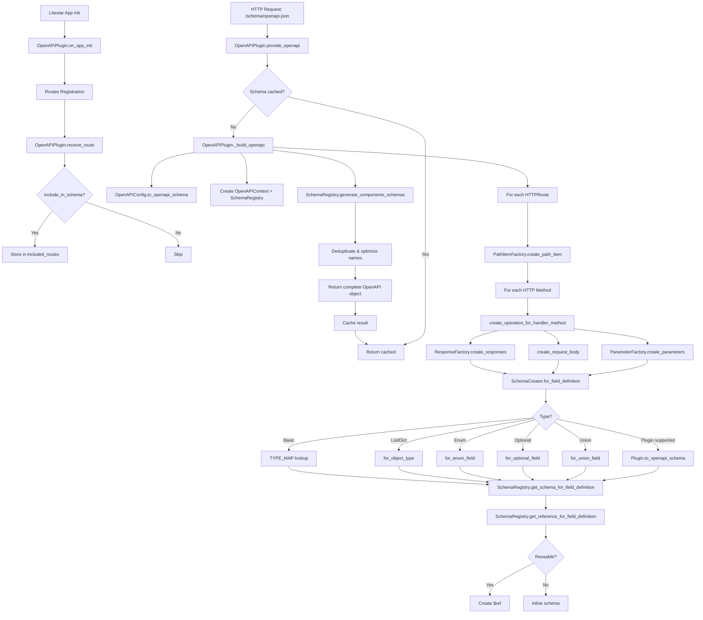

# Основные блоки генерации DTO OpenAPI
_Exported on 24.10.2025 at 9:00:12 GMT+5 from Cursor (1.7.54)_

---

**User**

Расскажи мне про основные блоки генерации DTO OpenAPI

Для этого подробно изучи код

Меня интересует логика, ее архитектура по блокам от момента как система собирает все роуты, и все про генерацию из ее метаданных итогового DTO опенапи

---

**Cursor**

Я изучу код генерации OpenAPI DTO в Litestar. Давайте начнем с основных модулей.

Отлично! Я подробно изучил код генерации OpenAPI DTO в Litestar. Позвольте мне объяснить архитектуру и логику системы по блокам.

## 🏗️ Архитектура генерации OpenAPI DTO в Litestar

### **1. ИНИЦИАЛИЗАЦИЯ И СБОР РОУТОВ**

#### 1.1 Регистрация роутов при старте приложения
```python
# litestar/app.py, строки 396-404
config.plugins.extend([OpenAPIPlugin(self), *openapi_schema_plugins])

for handler in chain(
    on_app_init or [],
    (p.on_app_init for p in config.plugins if isinstance(p, InitPluginProtocol)),
    [self._patch_opentelemetry_middleware],
):
    config = handler(config)
```

**Ключевой момент**: При инициализации приложения Litestar создается `OpenAPIPlugin`, который подписывается на события регистрации роутов.

#### 1.2 Сбор роутов через ReceiveRoutePlugin

```10:89:litestar/_openapi/plugin.py
def _build_openapi(self) -> OpenAPI:
    openapi_config = self.openapi_config

    if openapi_config.create_examples:
        from litestar._openapi.schema_generation.examples import ExampleFactory

        ExampleFactory.seed_random(openapi_config.random_seed)

    openapi = openapi_config.to_openapi_schema()
    context = OpenAPIContext(openapi_config=openapi_config, plugins=self.app.plugins.openapi)
    path_items: dict[str, PathItem] = {}
    for route in self.included_routes.values():
        path = route.path_format or "/"
        path_item = create_path_item_for_route(context, route)
        if existing_path_item := path_items.get(path):
            path_item = merge_path_item_operations(existing_path_item, path_item, for_path=path)
        path_items[path] = path_item

    openapi.paths = path_items
    openapi.components.schemas = context.schema_registry.generate_components_schemas()
    return openapi
```

**Процесс**:
- `receive_route()` вызывается для каждого зарегистрированного роута
- Роуты с `include_in_schema=True` сохраняются в `included_routes`
- При добавлении нового роута кэш OpenAPI схемы сбрасывается

---

### **2. КОНТЕКСТ И РЕЕСТР СХЕМ (SCHEMA REGISTRY)**

#### 2.1 OpenAPIContext - центральный координатор

```228:251:litestar/_openapi/datastructures.py
class OpenAPIContext:
    def __init__(
        self,
        openapi_config: OpenAPIConfig,
        plugins: Sequence[OpenAPISchemaPlugin],
    ) -> None:
        self.openapi_config = openapi_config
        self.plugins = plugins
        self.operation_ids: set[str] = set()
        self.schema_registry = SchemaRegistry()

    def add_operation_id(self, operation_id: str) -> None:
        """Add an operation ID to the context.

        Args:
            operation_id: Operation ID to add.
        """
        if operation_id in self.operation_ids:
            raise ImproperlyConfiguredException(
                "operation_ids must be unique, "
                f"please ensure the value of 'operation_id' is either not set or unique for {operation_id!r}"
            )
        self.operation_ids.add(operation_id)
```

**Роль**: 
- Хранит конфигурацию OpenAPI
- Управляет реестром схем
- Обеспечивает уникальность operation_id

#### 2.2 SchemaRegistry - управление компонентами схем

```89:226:litestar/_openapi/datastructures.py
class SchemaRegistry:
    """A registry for object schemas.

    This class is used to store schemas that we reference from other parts of the spec.

    Its main purpose is to allow us to generate the components/schemas section of the spec once we have
    collected all the schemas that should be included.

    This allows us to determine a path to the schema in the components/schemas section of the spec that
    is unique and as short as possible.
    """

    def __init__(self) -> None:
        self._schema_key_map: dict[tuple[str, ...], RegisteredSchema] = {}
        self._schema_reference_map: dict[int, RegisteredSchema] = {}
        self._model_name_groups: defaultdict[str, list[RegisteredSchema]] = defaultdict(list)
        self._component_type_map: dict[tuple[str, ...], FieldDefinition] = {}
    # ... методы get_schema_for_field_definition, get_reference_for_field_definition
```

**Назначение**:
- **Дедупликация**: предотвращает дублирование схем одного типа
- **Референсы**: создает `$ref` ссылки на переиспользуемые схемы
- **Генерация имен**: создает уникальные короткие имена для `components/schemas`
- **Генерация компонентов**: финальная сборка секции `components/schemas`

---

### **3. СОЗДАНИЕ PathItem ИЗ РОУТОВ**

#### 3.1 PathItemFactory - фабрика для создания PathItem

```24:138:litestar/_openapi/path_item.py
class PathItemFactory:
    """Factory for creating a PathItem instance for a given route."""

    def __init__(self, openapi_context: OpenAPIContext, route: HTTPRoute) -> None:
        self.context = openapi_context
        self.route = route
        self._path_item = PathItem()

    def create_path_item(self) -> PathItem:
        """Create a PathItem for the given route parsing all http_methods into Operation Models.

        Returns:
            A PathItem instance.
        """
        for http_method, route_handler in self.route.route_handler_map.items():
            if not route_handler.include_in_schema:
                continue

            operation = self.create_operation_for_handler_method(route_handler, HttpMethod(http_method))

            setattr(self._path_item, http_method.lower(), operation)

        return self._path_item

    def create_operation_for_handler_method(
        self, route_handler: HTTPRouteHandler, http_method: HttpMethod
    ) -> Operation:
        """Create an Operation instance for a given route handler and http method.
```

**Процесс создания Operation**:
1. **operation_id** - создание уникального ID
2. **parameters** - создание параметров (path, query, header, cookie)
3. **request_body** - создание тела запроса (если есть `data` поле)
4. **responses** - создание схем ответов
5. **metadata** - tags, summary, description, deprecated, security

---

### **4. ГЕНЕРАЦИЯ ПАРАМЕТРОВ (Parameters)**

#### 4.1 ParameterFactory - создание параметров

```77:250:litestar/_openapi/parameters.py
class ParameterFactory:
    """Factory for creating OpenAPI Parameters for a given route handler."""

    def __init__(
        self,
        context: OpenAPIContext,
        route_handler: BaseRouteHandler,
        path_parameters: dict[str, PathParameterDefinition],
    ) -> None:
        """Initialize ParameterFactory.

        Args:
            context: The OpenAPI context.
            route_handler: The route handler.
            path_parameters: The path parameters for the route.
        """
        self.context = context
        self.schema_creator = SchemaCreator.from_openapi_context(self.context, prefer_alias=True)
        self.route_handler = route_handler
        self.parameters = ParameterCollection(route_handler)
        self.dependency_providers = route_handler.dependencies
        self.layered_parameters = route_handler.parameter_field_definitions
        self.path_parameters = path_parameters
```

**Логика определения типа параметра**:
- **PATH**: если параметр в `path_parameters`
- **HEADER**: если `kwarg_definition.header` установлен
- **COOKIE**: если `kwarg_definition.cookie` установлен
- **QUERY**: по умолчанию для остальных

---

### **5. ГЕНЕРАЦИЯ REQUEST BODY**

```20:52:litestar/_openapi/request_body.py
def create_request_body(
    context: OpenAPIContext,
    handler_id: str,
    resolved_data_dto: type[AbstractDTO] | None,
    data_field: FieldDefinition,
) -> RequestBody:
    """Create a RequestBody instance for the given route handler's data field.

    Args:
        context: The OpenAPIContext instance.
        handler_id: The handler id.
        resolved_data_dto: The resolved data dto.
        data_field: The data field.

    Returns:
        A RequestBody instance.
    """
    media_type: RequestEncodingType | str = RequestEncodingType.JSON
    schema_creator = SchemaCreator.from_openapi_context(context, prefer_alias=True)
    if isinstance(data_field.kwarg_definition, BodyKwarg) and data_field.kwarg_definition.media_type:
        media_type = data_field.kwarg_definition.media_type

    if resolved_data_dto:
        schema = resolved_data_dto.create_openapi_schema(
            field_definition=data_field,
            handler_id=handler_id,
            schema_creator=schema_creator,
        )
    else:
        schema = schema_creator.for_field_definition(data_field)

    return RequestBody(required=True, content={media_type: OpenAPIMediaType(schema=schema)})
```

**Ключевой момент**: если у хэндлера есть DTO, используется его метод `create_openapi_schema`, иначе - стандартная генерация схемы.

---

### **6. ГЕНЕРАЦИЯ RESPONSES**

#### 6.1 ResponseFactory - создание схем ответов

```68:164:litestar/_openapi/responses.py
class ResponseFactory:
    """Factory for creating a Response instance for a given route handler."""

    def __init__(self, context: OpenAPIContext, route_handler: HTTPRouteHandler) -> None:
        """Initialize the factory.

        Args:
            context: An OpenAPIContext instance.
            route_handler: An HTTPRouteHandler instance.
        """
        self.context = context
        self.route_handler = route_handler
        self.field_definition = route_handler.parsed_fn_signature.return_type
        self.schema_creator = SchemaCreator.from_openapi_context(context, prefer_alias=False)

    def create_responses(self, raises_validation_error: bool) -> Responses | None:
        """Create the schema for responses, if any.

        Args:
            raises_validation_error: Boolean flag indicating whether the handler raises a ValidationException.

        Returns:
            Responses
        """
        responses: Responses = {
            str(self.route_handler.status_code): self.create_success_response(),
        }

        exceptions = list(self.route_handler.raises or [])
        if raises_validation_error and ValidationException not in exceptions:
            exceptions.append(ValidationException)

        for status_code, response in create_error_responses(exceptions=exceptions):
            responses[status_code] = response

        for status_code, response in self.create_additional_responses():
            responses[status_code] = response

        return responses or None
```

**Типы обрабатываемых ответов**:
- **Success response** (200, 201, etc.)
- **Error responses** из `raises` (400, 404, 500, etc.)
- **Additional responses** из явно заданных `responses`
- **Validation errors** (422) - автоматически добавляются

---

### **7. ГЕНЕРАЦИЯ СХЕМ (SchemaCreator) - СЕРДЦЕ СИСТЕМЫ**

#### 7.1 SchemaCreator - центральный генератор схем

```214:659:litestar/_openapi/schema_generation/schema.py
class SchemaCreator:
    __slots__ = ("generate_examples", "plugins", "prefer_alias", "schema_registry")

    def __init__(
        self,
        generate_examples: bool = False,
        plugins: Iterable[OpenAPISchemaPlugin] | None = None,
        prefer_alias: bool = True,
        schema_registry: SchemaRegistry | None = None,
    ) -> None:
        """Instantiate a SchemaCreator.

        Args:
            generate_examples: Whether to generate examples if none are given.
            plugins: A list of plugins.
            prefer_alias: Whether to prefer the alias name for the schema.
            schema_registry: A SchemaRegistry instance.
        """
        self.generate_examples = generate_examples
        self.plugins = plugins if plugins is not None else []
        self.prefer_alias = prefer_alias
        self.schema_registry = schema_registry or SchemaRegistry()
```

#### 7.2 Главный метод - for_field_definition

```280:328:litestar/_openapi/schema_generation/schema.py
def for_field_definition(self, field_definition: FieldDefinition) -> Schema | Reference:
    """Create a Schema for a given FieldDefinition.

    Args:
        field_definition: A signature field instance.

    Returns:
        A schema instance.
    """

    result: Schema | Reference

    if field_definition.is_new_type:
        result = self.for_new_type(field_definition)
    elif field_definition.is_type_alias_type:
        result = self.for_type_alias_type(field_definition)
    elif plugin_for_annotation := self.get_plugin_for(field_definition):
        result = self.for_plugin(field_definition, plugin_for_annotation)
    elif _should_create_literal_schema(field_definition):
        annotation = (
            make_non_optional_union(field_definition.annotation)
            if field_definition.is_optional
            else field_definition.annotation
        )
        result = create_literal_schema(
            annotation,
            include_null=field_definition.is_optional,
        )
    elif field_definition.is_optional:
        result = self.for_optional_field(field_definition)
    elif field_definition.is_enum:
        result = self.for_enum_field(field_definition)
    elif field_definition.is_union:
        result = self.for_union_field(field_definition)
    elif field_definition.is_type_var:
        result = self.for_typevar()
    elif self.is_constrained_field(field_definition):
        result = self.for_constrained_field(field_definition)
    elif field_definition.inner_types and not field_definition.is_generic:
        # this case does not recurse for all base cases, so it needs to happen
        # after all non-concrete cases
        result = self.for_object_type(field_definition)
    elif field_definition.is_subclass_of(UploadFile):
        result = self.for_upload_file(field_definition)
    else:
        result = create_schema_for_annotation(field_definition.annotation)

    return self.process_schema_result(field_definition, result) if isinstance(result, Schema) else result
```

**Стратегия обработки (приоритет сверху вниз)**:
1. **NewType** - разворачивание псевдонимов типов
2. **TypeAliasType** - разворачивание TypeAlias
3. **Plugin** - делегация специализированным плагинам (dataclass, TypedDict, Struct, Pagination)
4. **Literal** - создание схем с `const` или `enum`
5. **Optional** - создание `oneOf` с `null`
6. **Enum** - создание схем перечислений
7. **Union** - создание `oneOf` для union типов
8. **TypeVar** - generic параметры
9. **Constrained** - типы с ограничениями (min/max длина, границы чисел)
10. **Object types** - dict, list, Sequence, Mapping
11. **UploadFile** - специальная обработка
12. **Basic types** - int, str, float, bool, datetime, UUID, etc.

#### 7.3 TYPE_MAP - маппинг базовых типов

```79:117:litestar/_openapi/schema_generation/schema.py
TYPE_MAP: dict[type[Any] | None | Any, Schema] = {
    Decimal: Schema(type=OpenAPIType.NUMBER),
    defaultdict: Schema(type=OpenAPIType.OBJECT),
    deque: Schema(type=OpenAPIType.ARRAY),
    dict: Schema(type=OpenAPIType.OBJECT),
    frozenset: Schema(type=OpenAPIType.ARRAY),
    IPv4Address: Schema(type=OpenAPIType.STRING, format=OpenAPIFormat.IPV4),
    IPv4Interface: Schema(type=OpenAPIType.STRING, format=OpenAPIFormat.IPV4),
    IPv4Network: Schema(type=OpenAPIType.STRING, format=OpenAPIFormat.IPV4),
    IPv6Address: Schema(type=OpenAPIType.STRING, format=OpenAPIFormat.IPV6),
    IPv6Interface: Schema(type=OpenAPIType.STRING, format=OpenAPIFormat.IPV6),
    IPv6Network: Schema(type=OpenAPIType.STRING, format=OpenAPIFormat.IPV6),
    Iterable: Schema(type=OpenAPIType.ARRAY),
    list: Schema(type=OpenAPIType.ARRAY),
    Mapping: Schema(type=OpenAPIType.OBJECT),
    MutableMapping: Schema(type=OpenAPIType.OBJECT),
    MutableSequence: Schema(type=OpenAPIType.ARRAY),
    None: Schema(type=OpenAPIType.NULL),
    NoneType: Schema(type=OpenAPIType.NULL),
    OrderedDict: Schema(type=OpenAPIType.OBJECT),
    Path: Schema(type=OpenAPIType.STRING, format=OpenAPIFormat.URI),
    Pattern: Schema(type=OpenAPIType.STRING, format=OpenAPIFormat.REGEX),
    SecretBytes: Schema(type=OpenAPIType.STRING),
    SecretString: Schema(type=OpenAPIType.STRING),
    Sequence: Schema(type=OpenAPIType.ARRAY),
    set: Schema(type=OpenAPIType.ARRAY),
    tuple: Schema(type=OpenAPIType.ARRAY),
    UUID: Schema(type=OpenAPIType.STRING, format=OpenAPIFormat.UUID),
    bool: Schema(type=OpenAPIType.BOOLEAN),
    bytearray: Schema(type=OpenAPIType.STRING),
    bytes: Schema(type=OpenAPIType.STRING),
    date: Schema(type=OpenAPIType.STRING, format=OpenAPIFormat.DATE),
    datetime: Schema(type=OpenAPIType.STRING, format=OpenAPIFormat.DATE_TIME),
    float: Schema(type=OpenAPIType.NUMBER),
    int: Schema(type=OpenAPIType.INTEGER),
    str: Schema(type=OpenAPIType.STRING),
    time: Schema(type=OpenAPIType.STRING, format=OpenAPIFormat.DURATION),
    timedelta: Schema(type=OpenAPIType.STRING, format=OpenAPIFormat.DURATION),
}
```

---

### **8. ПЛАГИНЫ СХЕМ (Schema Plugins)**

#### 8.1 Система плагинов

```1:16:litestar/_openapi/schema_generation/plugins/__init__.py
from .dataclass import DataclassSchemaPlugin
from .pagination import PaginationSchemaPlugin
from .struct import StructSchemaPlugin
from .typed_dict import TypedDictSchemaPlugin

__all__ = ("openapi_schema_plugins",)

# NOTE: The Pagination type plugin has to come before the Dataclass plugin since the Pagination
# classes are dataclasses, but we want to handle them differently from how dataclasses are normally
# handled.
openapi_schema_plugins = [
    PaginationSchemaPlugin(),
    StructSchemaPlugin(),
    DataclassSchemaPlugin(),
    TypedDictSchemaPlugin(),
]
```

#### 8.2 Пример: DataclassSchemaPlugin

```17:44:litestar/_openapi/schema_generation/plugins/dataclass.py
class DataclassSchemaPlugin(OpenAPISchemaPlugin):
    def is_plugin_supported_field(self, field_definition: FieldDefinition) -> bool:
        return field_definition.is_dataclass_type

    def to_openapi_schema(self, field_definition: FieldDefinition, schema_creator: SchemaCreator) -> Schema:
        type_hints = field_definition.get_type_hints(include_extras=True, resolve_generics=True)
        dataclass_fields = fields(field_definition.type_)
        return schema_creator.create_component_schema(
            field_definition,
            required=sorted(
                field.name
                for field in dataclass_fields
                if (
                    field.default is MISSING
                    and field.default_factory is MISSING
                    and not is_optional_union(type_hints[field.name])
                )
            ),
            property_fields={
                field.name: FieldDefinition.from_kwarg(
                    annotation=type_hints[field.name],
                    name=field.name,
                    default=field.default if field.default is not dataclasses.MISSING else Empty,
                )
                for field in dataclass_fields
            },
        )
```

**Плагины обрабатывают**:
- **DataclassSchemaPlugin**: стандартные dataclasses
- **TypedDictSchemaPlugin**: TypedDict
- **StructSchemaPlugin**: msgspec.Struct
- **PaginationSchemaPlugin**: специфичные типы пагинации Litestar

---

### **9. ФИНАЛЬНАЯ СБОРКА (components/schemas)**

#### 9.1 Генерация компонентов

```204:225:litestar/_openapi/datastructures.py
def generate_components_schemas(self) -> dict[str, Schema]:
    """Generate the components/schemas section of the spec.

    Returns:
        A dictionary of schemas.
    """
    components_schemas: dict[str, Schema] = {}

    for name, name_group in self._model_name_groups.items():
        if len(name_group) == 1:
            self.set_reference_paths(name, name_group[0])
            components_schemas[name] = name_group[0].schema
            continue

        full_keys = [registered_schema.key for registered_schema in name_group]
        names = ["_".join(k) for k in self.remove_common_prefix(full_keys)]
        for name_, registered_schema in zip(names, name_group):
            self.set_reference_paths(name_, registered_schema)
            components_schemas[name_] = registered_schema.schema

    # Sort them by name to ensure they're always generated in the same order.
    return {name: components_schemas[name] for name in sorted(components_schemas.keys())}
```

**Оптимизация имен**:
- Если одно имя → используется короткое имя (`User`)
- Если конфликты → удаляется общий префикс (`api_v1_User`, `api_v2_User` → `v1_User`, `v2_User`)

---

## 🔄 ПОЛНЫЙ ПОТОК ГЕНЕРАЦИИ

```
1. APP INIT
   ↓
2. OpenAPIPlugin.on_app_init() 
   ↓
3. Routes Registration → OpenAPIPlugin.receive_route()
   ↓
4. Request for /schema/openapi.json
   ↓
5. OpenAPIPlugin._build_openapi()
   ├─ OpenAPIConfig.to_openapi_schema() → базовый OpenAPI объект
   ├─ OpenAPIContext создается с SchemaRegistry
   ├─ Для каждого route:
   │  ├─ PathItemFactory.create_path_item()
   │  │  └─ Для каждого HTTP метода:
   │  │     ├─ create_operation_for_handler_method()
   │  │     │  ├─ create_parameters_for_handler() → Parameters
   │  │     │  ├─ create_request_body() → RequestBody
   │  │     │  └─ create_responses_for_handler() → Responses
   │  │     └─ SchemaCreator.for_field_definition() для каждого типа
   │  │        ├─ Проверка плагинов
   │  │        ├─ Обработка типа
   │  │        ├─ SchemaRegistry.get_schema_for_field_definition()
   │  │        └─ SchemaRegistry.get_reference_for_field_definition()
   │  └─ merge_path_item_operations() если несколько методов
   ├─ openapi.paths = path_items
   └─ openapi.components.schemas = context.schema_registry.generate_components_schemas()
      ↓
6. OpenAPI.to_schema() → dict (JSON serializable)
   ↓
7. Return JSON response
```

---

## ✨ КЛЮЧЕВЫЕ ОСОБЕННОСТИ АРХИТЕКТУРЫ

1. **Ленивая генерация**: схема создается только при запросе
2. **Кэширование**: после создания схема кэшируется до добавления новых роутов
3. **Плагинная система**: расширяемая поддержка новых типов данных
4. **Дедупликация**: SchemaRegistry предотвращает дублирование схем
5. **Референсы**: автоматическое создание `$ref` для переиспользуемых типов
6. **DTO интеграция**: поддержка кастомной генерации схем через DTO
7. **Метаданные**: поддержка KwargDefinition для описания ограничений и метаданных

Эта архитектура обеспечивает гибкость, производительность и расширяемость при генерации OpenAPI спецификации.

```python
# litestar/app.py, строки 396-404
config.plugins.extend([OpenAPIPlugin(self), *openapi_schema_plugins])

for handler in chain(
    on_app_init or [],
    (p.on_app_init for p in config.plugins if isinstance(p, InitPluginProtocol)),
    [self._patch_opentelemetry_middleware],
):
    config = handler(config)
```

```python
def _build_openapi(self) -> OpenAPI:
    openapi_config = self.openapi_config

    if openapi_config.create_examples:
        from litestar._openapi.schema_generation.examples import ExampleFactory

        ExampleFactory.seed_random(openapi_config.random_seed)

    openapi = openapi_config.to_openapi_schema()
    context = OpenAPIContext(openapi_config=openapi_config, plugins=self.app.plugins.openapi)
    path_items: dict[str, PathItem] = {}
    for route in self.included_routes.values():
        path = route.path_format or "/"
        path_item = create_path_item_for_route(context, route)
        if existing_path_item := path_items.get(path):
            path_item = merge_path_item_operations(existing_path_item, path_item, for_path=path)
        path_items[path] = path_item

    openapi.paths = path_items
    openapi.components.schemas = context.schema_registry.generate_components_schemas()
    return openapi
```

```python
class OpenAPIContext:
    def __init__(
        self,
        openapi_config: OpenAPIConfig,
        plugins: Sequence[OpenAPISchemaPlugin],
    ) -> None:
        self.openapi_config = openapi_config
        self.plugins = plugins
        self.operation_ids: set[str] = set()
        self.schema_registry = SchemaRegistry()

    def add_operation_id(self, operation_id: str) -> None:
        """Add an operation ID to the context.

        Args:
            operation_id: Operation ID to add.
        """
        if operation_id in self.operation_ids:
            raise ImproperlyConfiguredException(
                "operation_ids must be unique, "
                f"please ensure the value of 'operation_id' is either not set or unique for {operation_id!r}"
            )
        self.operation_ids.add(operation_id)
```

```python
class SchemaRegistry:
    """A registry for object schemas.

    This class is used to store schemas that we reference from other parts of the spec.

    Its main purpose is to allow us to generate the components/schemas section of the spec once we have
    collected all the schemas that should be included.

    This allows us to determine a path to the schema in the components/schemas section of the spec that
    is unique and as short as possible.
    """

    def __init__(self) -> None:
        self._schema_key_map: dict[tuple[str, ...], RegisteredSchema] = {}
        self._schema_reference_map: dict[int, RegisteredSchema] = {}
        self._model_name_groups: defaultdict[str, list[RegisteredSchema]] = defaultdict(list)
        self._component_type_map: dict[tuple[str, ...], FieldDefinition] = {}
    # ... методы get_schema_for_field_definition, get_reference_for_field_definition
```

```python
class PathItemFactory:
    """Factory for creating a PathItem instance for a given route."""

    def __init__(self, openapi_context: OpenAPIContext, route: HTTPRoute) -> None:
        self.context = openapi_context
        self.route = route
        self._path_item = PathItem()

    def create_path_item(self) -> PathItem:
        """Create a PathItem for the given route parsing all http_methods into Operation Models.

        Returns:
            A PathItem instance.
        """
        for http_method, route_handler in self.route.route_handler_map.items():
            if not route_handler.include_in_schema:
                continue

            operation = self.create_operation_for_handler_method(route_handler, HttpMethod(http_method))

            setattr(self._path_item, http_method.lower(), operation)

        return self._path_item

    def create_operation_for_handler_method(
        self, route_handler: HTTPRouteHandler, http_method: HttpMethod
    ) -> Operation:
        """Create an Operation instance for a given route handler and http method.
```

```python
class ParameterFactory:
    """Factory for creating OpenAPI Parameters for a given route handler."""

    def __init__(
        self,
        context: OpenAPIContext,
        route_handler: BaseRouteHandler,
        path_parameters: dict[str, PathParameterDefinition],
    ) -> None:
        """Initialize ParameterFactory.

        Args:
            context: The OpenAPI context.
            route_handler: The route handler.
            path_parameters: The path parameters for the route.
        """
        self.context = context
        self.schema_creator = SchemaCreator.from_openapi_context(self.context, prefer_alias=True)
        self.route_handler = route_handler
        self.parameters = ParameterCollection(route_handler)
        self.dependency_providers = route_handler.dependencies
        self.layered_parameters = route_handler.parameter_field_definitions
        self.path_parameters = path_parameters
```

```python
def create_request_body(
    context: OpenAPIContext,
    handler_id: str,
    resolved_data_dto: type[AbstractDTO] | None,
    data_field: FieldDefinition,
) -> RequestBody:
    """Create a RequestBody instance for the given route handler's data field.

    Args:
        context: The OpenAPIContext instance.
        handler_id: The handler id.
        resolved_data_dto: The resolved data dto.
        data_field: The data field.

    Returns:
        A RequestBody instance.
    """
    media_type: RequestEncodingType | str = RequestEncodingType.JSON
    schema_creator = SchemaCreator.from_openapi_context(context, prefer_alias=True)
    if isinstance(data_field.kwarg_definition, BodyKwarg) and data_field.kwarg_definition.media_type:
        media_type = data_field.kwarg_definition.media_type

    if resolved_data_dto:
        schema = resolved_data_dto.create_openapi_schema(
            field_definition=data_field,
            handler_id=handler_id,
            schema_creator=schema_creator,
        )
    else:
        schema = schema_creator.for_field_definition(data_field)

    return RequestBody(required=True, content={media_type: OpenAPIMediaType(schema=schema)})
```

```python
class ResponseFactory:
    """Factory for creating a Response instance for a given route handler."""

    def __init__(self, context: OpenAPIContext, route_handler: HTTPRouteHandler) -> None:
        """Initialize the factory.

        Args:
            context: An OpenAPIContext instance.
            route_handler: An HTTPRouteHandler instance.
        """
        self.context = context
        self.route_handler = route_handler
        self.field_definition = route_handler.parsed_fn_signature.return_type
        self.schema_creator = SchemaCreator.from_openapi_context(context, prefer_alias=False)

    def create_responses(self, raises_validation_error: bool) -> Responses | None:
        """Create the schema for responses, if any.

        Args:
            raises_validation_error: Boolean flag indicating whether the handler raises a ValidationException.

        Returns:
            Responses
        """
        responses: Responses = {
            str(self.route_handler.status_code): self.create_success_response(),
        }

        exceptions = list(self.route_handler.raises or [])
        if raises_validation_error and ValidationException not in exceptions:
            exceptions.append(ValidationException)

        for status_code, response in create_error_responses(exceptions=exceptions):
            responses[status_code] = response

        for status_code, response in self.create_additional_responses():
            responses[status_code] = response

        return responses or None
```

```python
class SchemaCreator:
    __slots__ = ("generate_examples", "plugins", "prefer_alias", "schema_registry")

    def __init__(
        self,
        generate_examples: bool = False,
        plugins: Iterable[OpenAPISchemaPlugin] | None = None,
        prefer_alias: bool = True,
        schema_registry: SchemaRegistry | None = None,
    ) -> None:
        """Instantiate a SchemaCreator.

        Args:
            generate_examples: Whether to generate examples if none are given.
            plugins: A list of plugins.
            prefer_alias: Whether to prefer the alias name for the schema.
            schema_registry: A SchemaRegistry instance.
        """
        self.generate_examples = generate_examples
        self.plugins = plugins if plugins is not None else []
        self.prefer_alias = prefer_alias
        self.schema_registry = schema_registry or SchemaRegistry()
```

```python
def for_field_definition(self, field_definition: FieldDefinition) -> Schema | Reference:
    """Create a Schema for a given FieldDefinition.

    Args:
        field_definition: A signature field instance.

    Returns:
        A schema instance.
    """

    result: Schema | Reference

    if field_definition.is_new_type:
        result = self.for_new_type(field_definition)
    elif field_definition.is_type_alias_type:
        result = self.for_type_alias_type(field_definition)
    elif plugin_for_annotation := self.get_plugin_for(field_definition):
        result = self.for_plugin(field_definition, plugin_for_annotation)
    elif _should_create_literal_schema(field_definition):
        annotation = (
            make_non_optional_union(field_definition.annotation)
            if field_definition.is_optional
            else field_definition.annotation
        )
        result = create_literal_schema(
            annotation,
            include_null=field_definition.is_optional,
        )
    elif field_definition.is_optional:
        result = self.for_optional_field(field_definition)
    elif field_definition.is_enum:
        result = self.for_enum_field(field_definition)
    elif field_definition.is_union:
        result = self.for_union_field(field_definition)
    elif field_definition.is_type_var:
        result = self.for_typevar()
    elif self.is_constrained_field(field_definition):
        result = self.for_constrained_field(field_definition)
    elif field_definition.inner_types and not field_definition.is_generic:
        # this case does not recurse for all base cases, so it needs to happen
        # after all non-concrete cases
        result = self.for_object_type(field_definition)
    elif field_definition.is_subclass_of(UploadFile):
        result = self.for_upload_file(field_definition)
    else:
        result = create_schema_for_annotation(field_definition.annotation)

    return self.process_schema_result(field_definition, result) if isinstance(result, Schema) else result
```

```python
TYPE_MAP: dict[type[Any] | None | Any, Schema] = {
    Decimal: Schema(type=OpenAPIType.NUMBER),
    defaultdict: Schema(type=OpenAPIType.OBJECT),
    deque: Schema(type=OpenAPIType.ARRAY),
    dict: Schema(type=OpenAPIType.OBJECT),
    frozenset: Schema(type=OpenAPIType.ARRAY),
    IPv4Address: Schema(type=OpenAPIType.STRING, format=OpenAPIFormat.IPV4),
    IPv4Interface: Schema(type=OpenAPIType.STRING, format=OpenAPIFormat.IPV4),
    IPv4Network: Schema(type=OpenAPIType.STRING, format=OpenAPIFormat.IPV4),
    IPv6Address: Schema(type=OpenAPIType.STRING, format=OpenAPIFormat.IPV6),
    IPv6Interface: Schema(type=OpenAPIType.STRING, format=OpenAPIFormat.IPV6),
    IPv6Network: Schema(type=OpenAPIType.STRING, format=OpenAPIFormat.IPV6),
    Iterable: Schema(type=OpenAPIType.ARRAY),
    list: Schema(type=OpenAPIType.ARRAY),
    Mapping: Schema(type=OpenAPIType.OBJECT),
    MutableMapping: Schema(type=OpenAPIType.OBJECT),
    MutableSequence: Schema(type=OpenAPIType.ARRAY),
    None: Schema(type=OpenAPIType.NULL),
    NoneType: Schema(type=OpenAPIType.NULL),
    OrderedDict: Schema(type=OpenAPIType.OBJECT),
    Path: Schema(type=OpenAPIType.STRING, format=OpenAPIFormat.URI),
    Pattern: Schema(type=OpenAPIType.STRING, format=OpenAPIFormat.REGEX),
    SecretBytes: Schema(type=OpenAPIType.STRING),
    SecretString: Schema(type=OpenAPIType.STRING),
    Sequence: Schema(type=OpenAPIType.ARRAY),
    set: Schema(type=OpenAPIType.ARRAY),
    tuple: Schema(type=OpenAPIType.ARRAY),
    UUID: Schema(type=OpenAPIType.STRING, format=OpenAPIFormat.UUID),
    bool: Schema(type=OpenAPIType.BOOLEAN),
    bytearray: Schema(type=OpenAPIType.STRING),
    bytes: Schema(type=OpenAPIType.STRING),
    date: Schema(type=OpenAPIType.STRING, format=OpenAPIFormat.DATE),
    datetime: Schema(type=OpenAPIType.STRING, format=OpenAPIFormat.DATE_TIME),
    float: Schema(type=OpenAPIType.NUMBER),
    int: Schema(type=OpenAPIType.INTEGER),
    str: Schema(type=OpenAPIType.STRING),
    time: Schema(type=OpenAPIType.STRING, format=OpenAPIFormat.DURATION),
    timedelta: Schema(type=OpenAPIType.STRING, format=OpenAPIFormat.DURATION),
}
```

```python
from .dataclass import DataclassSchemaPlugin
from .pagination import PaginationSchemaPlugin
from .struct import StructSchemaPlugin
from .typed_dict import TypedDictSchemaPlugin

__all__ = ("openapi_schema_plugins",)

# NOTE: The Pagination type plugin has to come before the Dataclass plugin since the Pagination
# classes are dataclasses, but we want to handle them differently from how dataclasses are normally
# handled.
openapi_schema_plugins = [
    PaginationSchemaPlugin(),
    StructSchemaPlugin(),
    DataclassSchemaPlugin(),
    TypedDictSchemaPlugin(),
]
```

```python
class DataclassSchemaPlugin(OpenAPISchemaPlugin):
    def is_plugin_supported_field(self, field_definition: FieldDefinition) -> bool:
        return field_definition.is_dataclass_type

    def to_openapi_schema(self, field_definition: FieldDefinition, schema_creator: SchemaCreator) -> Schema:
        type_hints = field_definition.get_type_hints(include_extras=True, resolve_generics=True)
        dataclass_fields = fields(field_definition.type_)
        return schema_creator.create_component_schema(
            field_definition,
            required=sorted(
                field.name
                for field in dataclass_fields
                if (
                    field.default is MISSING
                    and field.default_factory is MISSING
                    and not is_optional_union(type_hints[field.name])
                )
            ),
            property_fields={
                field.name: FieldDefinition.from_kwarg(
                    annotation=type_hints[field.name],
                    name=field.name,
                    default=field.default if field.default is not dataclasses.MISSING else Empty,
                )
                for field in dataclass_fields
            },
        )
```

```python
def generate_components_schemas(self) -> dict[str, Schema]:
    """Generate the components/schemas section of the spec.

    Returns:
        A dictionary of schemas.
    """
    components_schemas: dict[str, Schema] = {}

    for name, name_group in self._model_name_groups.items():
        if len(name_group) == 1:
            self.set_reference_paths(name, name_group[0])
            components_schemas[name] = name_group[0].schema
            continue

        full_keys = [registered_schema.key for registered_schema in name_group]
        names = ["_".join(k) for k in self.remove_common_prefix(full_keys)]
        for name_, registered_schema in zip(names, name_group):
            self.set_reference_paths(name_, registered_schema)
            components_schemas[name_] = registered_schema.schema

    # Sort them by name to ensure they're always generated in the same order.
    return {name: components_schemas[name] for name in sorted(components_schemas.keys())}
```

```plaintext
1. APP INIT
   ↓
2. OpenAPIPlugin.on_app_init() 
   ↓
3. Routes Registration → OpenAPIPlugin.receive_route()
   ↓
4. Request for /schema/openapi.json
   ↓
5. OpenAPIPlugin._build_openapi()
   ├─ OpenAPIConfig.to_openapi_schema() → базовый OpenAPI объект
   ├─ OpenAPIContext создается с SchemaRegistry
   ├─ Для каждого route:
   │  ├─ PathItemFactory.create_path_item()
   │  │  └─ Для каждого HTTP метода:
   │  │     ├─ create_operation_for_handler_method()
   │  │     │  ├─ create_parameters_for_handler() → Parameters
   │  │     │  ├─ create_request_body() → RequestBody
   │  │     │  └─ create_responses_for_handler() → Responses
   │  │     └─ SchemaCreator.for_field_definition() для каждого типа
   │  │        ├─ Проверка плагинов
   │  │        ├─ Обработка типа
   │  │        ├─ SchemaRegistry.get_schema_for_field_definition()
   │  │        └─ SchemaRegistry.get_reference_for_field_definition()
   │  └─ merge_path_item_operations() если несколько методов
   ├─ openapi.paths = path_items
   └─ openapi.components.schemas = context.schema_registry.generate_components_schemas()
      ↓
6. OpenAPI.to_schema() → dict (JSON serializable)
   ↓
7. Return JSON response
```

---

**User**

добавь сюда в ответ все необходимые еще метаданные для нейронной сети, чтобы я экспортировал этот ответ в формате md и загрузил в другой репозиторий, чтобы на основании этих данных сгенерировать новый запрос для реализации кода в моем проекте

---

**Cursor**

Добавляю полные метаданные для нейронной сети с примерами кода и структурированной информацией.

# 📘 Архитектура генерации OpenAPI DTO в Litestar

## 🏷️ Метаданные проекта

```yaml
project:
  name: "Litestar OpenAPI DTO Generation"
  framework: "Litestar 2.x/3.x"
  language: "Python 3.11+"
  architecture_pattern: "Plugin-based Factory Pattern"
  
technologies:
  - Python 3.11+
  - OpenAPI 3.1.0
  - msgspec
  - dataclasses
  - typing (TypedDict, Literal, Generic)
  
key_concepts:
  - Plugin Architecture
  - Schema Registry Pattern
  - Factory Pattern
  - Lazy Initialization
  - Type Introspection
  - Metadata-driven Schema Generation
  
design_patterns:
  - Factory Pattern (PathItemFactory, ParameterFactory, ResponseFactory)
  - Registry Pattern (SchemaRegistry, OpenAPIContext)
  - Strategy Pattern (OpenAPISchemaPlugin)
  - Builder Pattern (SchemaCreator)
  - Observer Pattern (ReceiveRoutePlugin)
  
file_structure:
  base_path: "litestar/_openapi/"
  key_modules:
    - plugin.py                    # Главный плагин OpenAPI
    - datastructures.py           # SchemaRegistry, OpenAPIContext
    - path_item.py                # Генерация PathItem и Operation
    - parameters.py               # Генерация параметров (path/query/header/cookie)
    - request_body.py             # Генерация request body
    - responses.py                # Генерация responses
    - schema_generation/schema.py # SchemaCreator - сердце генерации
    - schema_generation/plugins/  # Плагины для типов данных
```

---

## 📊 Диаграмма архитектуры



---

## 🔧 Ключевые компоненты

### 1. OpenAPIPlugin - Главный координатор

**Файл**: `litestar/_openapi/plugin.py`

**Ответственность**:
- Инициализация при старте приложения
- Сбор роутов через `receive_route()`
- Ленивая генерация OpenAPI схемы
- Кэширование результата

**Ключевые методы**:

```python
class OpenAPIPlugin(InitPlugin, ReceiveRoutePlugin):
    def on_app_init(self, app_config: AppConfig) -> AppConfig
    def receive_route(self, route: BaseRoute) -> None
    def _build_openapi(self) -> OpenAPI
    def provide_openapi(self) -> OpenAPI
    def provide_openapi_schema(self) -> dict[str, Any]
```

**Код метода _build_openapi**:

```python
def _build_openapi(self) -> OpenAPI:
    openapi_config = self.openapi_config
    
    if openapi_config.create_examples:
        from litestar._openapi.schema_generation.examples import ExampleFactory
        ExampleFactory.seed_random(openapi_config.random_seed)
    
    openapi = openapi_config.to_openapi_schema()
    context = OpenAPIContext(openapi_config=openapi_config, plugins=self.app.plugins.openapi)
    path_items: dict[str, PathItem] = {}
    
    for route in self.included_routes.values():
        path = route.path_format or "/"
        path_item = create_path_item_for_route(context, route)
        if existing_path_item := path_items.get(path):
            path_item = merge_path_item_operations(existing_path_item, path_item, for_path=path)
        path_items[path] = path_item
    
    openapi.paths = path_items
    openapi.components.schemas = context.schema_registry.generate_components_schemas()
    return openapi
```

---

### 2. SchemaRegistry - Реестр схем

**Файл**: `litestar/_openapi/datastructures.py`

**Ответственность**:
- Дедупликация схем одинаковых типов
- Создание референсов ($ref) на переиспользуемые схемы
- Генерация уникальных имен для components/schemas
- Оптимизация имен (удаление общих префиксов)

**Структура данных**:

```python
class SchemaRegistry:
    _schema_key_map: dict[tuple[str, ...], RegisteredSchema]      # Схемы по ключам
    _schema_reference_map: dict[int, RegisteredSchema]            # Референсы по ID
    _model_name_groups: defaultdict[str, list[RegisteredSchema]]  # Группировка по именам
    _component_type_map: dict[tuple[str, ...], FieldDefinition]   # Типы компонентов
```

**Алгоритм генерации имен**:

```python
def generate_components_schemas(self) -> dict[str, Schema]:
    components_schemas: dict[str, Schema] = {}
    
    for name, name_group in self._model_name_groups.items():
        if len(name_group) == 1:
            # Одна схема с таким именем - используем короткое имя
            self.set_reference_paths(name, name_group[0])
            components_schemas[name] = name_group[0].schema
            continue
        
        # Конфликт имен - удаляем общий префикс
        full_keys = [registered_schema.key for registered_schema in name_group]
        names = ["_".join(k) for k in self.remove_common_prefix(full_keys)]
        for name_, registered_schema in zip(names, name_group):
            self.set_reference_paths(name_, registered_schema)
            components_schemas[name_] = registered_schema.schema
    
    return {name: components_schemas[name] for name in sorted(components_schemas.keys())}
```

**Примеры ключей**:
- `("app", "models", "User")` → `User`
- `("api", "v1", "models", "User")` + `("api", "v2", "models", "User")` → `v1_models_User`, `v2_models_User`

---

### 3. SchemaCreator - Генератор схем

**Файл**: `litestar/_openapi/schema_generation/schema.py`

**Ответственность**:
- Анализ типов через FieldDefinition
- Делегация специализированным плагинам
- Рекурсивная обработка составных типов
- Применение метаданных из KwargDefinition

**Стратегия обработки типов**:

```python
def for_field_definition(self, field_definition: FieldDefinition) -> Schema | Reference:
    # 1. NewType - разворачивание псевдонимов
    if field_definition.is_new_type:
        return self.for_new_type(field_definition)
    
    # 2. TypeAliasType (type MyType = ...)
    elif field_definition.is_type_alias_type:
        return self.for_type_alias_type(field_definition)
    
    # 3. Plugin - делегация специализированным плагинам
    elif plugin_for_annotation := self.get_plugin_for(field_definition):
        return self.for_plugin(field_definition, plugin_for_annotation)
    
    # 4. Literal - создание const/enum схем
    elif _should_create_literal_schema(field_definition):
        return create_literal_schema(annotation, include_null=field_definition.is_optional)
    
    # 5. Optional - oneOf с null
    elif field_definition.is_optional:
        return self.for_optional_field(field_definition)
    
    # 6. Enum - перечисления
    elif field_definition.is_enum:
        return self.for_enum_field(field_definition)
    
    # 7. Union - oneOf для union типов
    elif field_definition.is_union:
        return self.for_union_field(field_definition)
    
    # 8. TypeVar - generic параметры
    elif field_definition.is_type_var:
        return self.for_typevar()
    
    # 9. Constrained - типы с ограничениями
    elif self.is_constrained_field(field_definition):
        return self.for_constrained_field(field_definition)
    
    # 10. Object types - dict, list, Sequence, Mapping
    elif field_definition.inner_types and not field_definition.is_generic:
        return self.for_object_type(field_definition)
    
    # 11. UploadFile - специальная обработка
    elif field_definition.is_subclass_of(UploadFile):
        return self.for_upload_file(field_definition)
    
    # 12. Basic types - из TYPE_MAP
    else:
        return create_schema_for_annotation(field_definition.annotation)
```

**TYPE_MAP - Маппинг базовых типов**:

```python
TYPE_MAP: dict[type[Any] | None | Any, Schema] = {
    int: Schema(type=OpenAPIType.INTEGER),
    str: Schema(type=OpenAPIType.STRING),
    float: Schema(type=OpenAPIType.NUMBER),
    bool: Schema(type=OpenAPIType.BOOLEAN),
    
    datetime: Schema(type=OpenAPIType.STRING, format=OpenAPIFormat.DATE_TIME),
    date: Schema(type=OpenAPIType.STRING, format=OpenAPIFormat.DATE),
    time: Schema(type=OpenAPIType.STRING, format=OpenAPIFormat.DURATION),
    UUID: Schema(type=OpenAPIType.STRING, format=OpenAPIFormat.UUID),
    
    list: Schema(type=OpenAPIType.ARRAY),
    dict: Schema(type=OpenAPIType.OBJECT),
    set: Schema(type=OpenAPIType.ARRAY),
    tuple: Schema(type=OpenAPIType.ARRAY),
    
    IPv4Address: Schema(type=OpenAPIType.STRING, format=OpenAPIFormat.IPV4),
    IPv6Address: Schema(type=OpenAPIType.STRING, format=OpenAPIFormat.IPV6),
    Path: Schema(type=OpenAPIType.STRING, format=OpenAPIFormat.URI),
    
    NoneType: Schema(type=OpenAPIType.NULL),
    # ... и другие
}
```

---

### 4. Система плагинов (OpenAPISchemaPlugin)

**Файл**: `litestar/_openapi/schema_generation/plugins/__init__.py`

**Список плагинов** (в порядке приоритета):

```python
openapi_schema_plugins = [
    PaginationSchemaPlugin(),  # Должен быть первым (Pagination - это dataclass)
    StructSchemaPlugin(),      # msgspec.Struct
    DataclassSchemaPlugin(),   # @dataclass
    TypedDictSchemaPlugin(),   # TypedDict
]
```

#### 4.1 DataclassSchemaPlugin

```python
class DataclassSchemaPlugin(OpenAPISchemaPlugin):
    def is_plugin_supported_field(self, field_definition: FieldDefinition) -> bool:
        return field_definition.is_dataclass_type
    
    def to_openapi_schema(self, field_definition: FieldDefinition, schema_creator: SchemaCreator) -> Schema:
        type_hints = field_definition.get_type_hints(include_extras=True, resolve_generics=True)
        dataclass_fields = fields(field_definition.type_)
        
        return schema_creator.create_component_schema(
            field_definition,
            required=sorted(
                field.name
                for field in dataclass_fields
                if (
                    field.default is MISSING
                    and field.default_factory is MISSING
                    and not is_optional_union(type_hints[field.name])
                )
            ),
            property_fields={
                field.name: FieldDefinition.from_kwarg(
                    annotation=type_hints[field.name],
                    name=field.name,
                    default=field.default if field.default is not dataclasses.MISSING else Empty,
                )
                for field in dataclass_fields
            },
        )
```

#### 4.2 StructSchemaPlugin (msgspec)

```python
class StructSchemaPlugin(OpenAPISchemaPlugin):
    def is_plugin_supported_field(self, field_definition: FieldDefinition) -> bool:
        return not field_definition.is_union and field_definition.is_subclass_of(Struct)
    
    def to_openapi_schema(self, field_definition: FieldDefinition, schema_creator: SchemaCreator) -> Schema:
        type_hints = field_definition.get_type_hints(include_extras=True, resolve_generics=True)
        struct_info: msgspec.inspect.StructType = msgspec.inspect.type_info(field_definition.type_)
        struct_fields = struct_info.fields
        
        property_fields = {}
        for field in struct_fields:
            field_definition_kwargs = {}
            if kwarg_definition := kwarg_definition_from_field(field)[0]:
                field_definition_kwargs["kwarg_definition"] = kwarg_definition
            
            property_fields[field.encode_name] = FieldDefinition.from_annotation(
                annotation=type_hints[field.name],
                name=field.encode_name,
                default=field.default if field.default not in {msgspec.NODEFAULT, msgspec.UNSET} else Empty,
                **field_definition_kwargs,
            )
        
        required = [
            field.encode_name
            for field in struct_fields
            if self._is_field_required(field=field) and not is_optional_union(type_hints[field.name])
        ]
        
        # Поддержка tagged unions: https://jcristharif.com/msgspec/structs.html#tagged-unions
        if struct_info.tag_field:
            property_fields[struct_info.tag_field] = FieldDefinition.from_annotation(Literal[struct_info.tag])
            required.append(struct_info.tag_field)
        
        return schema_creator.create_component_schema(
            field_definition,
            required=sorted(required),
            property_fields=property_fields,
        )
```

#### 4.3 TypedDictSchemaPlugin

```python
class TypedDictSchemaPlugin(OpenAPISchemaPlugin):
    def is_plugin_supported_field(self, field_definition: FieldDefinition) -> bool:
        return field_definition.is_typeddict_type
    
    def to_openapi_schema(self, field_definition: FieldDefinition, schema_creator: SchemaCreator) -> Schema:
        type_hints = field_definition.get_type_hints(include_extras=True, resolve_generics=True)
        
        return schema_creator.create_component_schema(
            field_definition,
            required=sorted(getattr(field_definition.type_, "__required_keys__", [])),
            property_fields={k: FieldDefinition.from_kwarg(v, k) for k, v in type_hints.items()},
        )
```

#### 4.4 PaginationSchemaPlugin

```python
class PaginationSchemaPlugin(OpenAPISchemaPlugin):
    def is_plugin_supported_field(self, field_definition: FieldDefinition) -> bool:
        return field_definition.origin in (ClassicPagination, CursorPagination, OffsetPagination)
    
    def to_openapi_schema(self, field_definition: FieldDefinition, schema_creator: SchemaCreator) -> Schema:
        if field_definition.origin is ClassicPagination:
            return Schema(
                type=OpenAPIType.OBJECT,
                properties={
                    "items": Schema(
                        type=OpenAPIType.ARRAY,
                        items=schema_creator.for_field_definition(field_definition.inner_types[0]),
                    ),
                    "page_size": Schema(type=OpenAPIType.INTEGER, description="Number of items per page."),
                    "current_page": Schema(type=OpenAPIType.INTEGER, description="Current page number."),
                    "total_pages": Schema(type=OpenAPIType.INTEGER, description="Total number of pages."),
                },
            )
        # ... аналогично для OffsetPagination и CursorPagination
```

---

### 5. PathItemFactory - Генератор PathItem

**Файл**: `litestar/_openapi/path_item.py`

**Процесс создания Operation**:

```python
def create_operation_for_handler_method(
    self, route_handler: HTTPRouteHandler, http_method: HttpMethod
) -> Operation:
    # 1. Создание operation_id
    operation_id = self.create_operation_id(route_handler, http_method)
    
    # 2. Создание параметров (path, query, header, cookie)
    parameters = create_parameters_for_handler(
        self.context, route_handler, self.route.path_parameters
    )
    
    # 3. Создание request body (если есть data поле)
    signature_fields = route_handler.parsed_fn_signature.parameters
    request_body = None
    if data_field := signature_fields.get("data"):
        request_body = create_request_body(
            self.context, route_handler.handler_id, route_handler.data_dto, data_field
        )
    
    # 4. Создание responses
    raises_validation_error = bool(data_field or self._path_item.parameters or parameters)
    responses = create_responses_for_handler(
        self.context, route_handler, raises_validation_error=raises_validation_error
    )
    
    # 5. Сборка Operation
    return route_handler.operation_class(
        operation_id=operation_id,
        tags=sorted(route_handler.tags) if route_handler.tags else None,
        summary=route_handler.summary or SEPARATORS_CLEANUP_PATTERN.sub("", route_handler.handler_name.title()),
        description=self.create_description_for_handler(route_handler),
        deprecated=route_handler.deprecated,
        responses=responses,
        request_body=request_body,
        parameters=parameters or None,
        security=list(route_handler.security) if route_handler.security else None,
    )
```

---

### 6. ParameterFactory - Генератор параметров

**Файл**: `litestar/_openapi/parameters.py`

**Определение типа параметра**:

```python
def create_parameter(self, field_definition: FieldDefinition, parameter_name: str) -> Parameter:
    kwarg_definition = (
        field_definition.kwarg_definition if isinstance(field_definition.kwarg_definition, ParameterKwarg) else None
    )
    
    # Определение param_in (PATH, QUERY, HEADER, COOKIE)
    if parameter_name in self.path_parameters:
        param_in = ParamType.PATH
        is_required = True
    elif kwarg_definition and kwarg_definition.header:
        parameter_name = kwarg_definition.header
        param_in = ParamType.HEADER
        is_required = field_definition.is_required
    elif kwarg_definition and kwarg_definition.cookie:
        parameter_name = kwarg_definition.cookie
        param_in = ParamType.COOKIE
        is_required = field_definition.is_required
    else:
        is_required = field_definition.is_required
        param_in = ParamType.QUERY
        parameter_name = kwarg_definition.query if kwarg_definition and kwarg_definition.query else parameter_name
    
    # Создание схемы параметра
    result = self.schema_creator.for_field_definition(field_definition)
    schema = result if isinstance(result, Schema) else self.context.schema_registry.from_reference(result).schema
    
    return Parameter(
        description=schema.description,
        name=parameter_name,
        param_in=param_in,
        required=is_required,
        schema=result,
        examples=examples or None,
    )
```

**Обработка dependencies**:

```python
def create_parameters_for_field_definitions(self, fields: dict[str, FieldDefinition]) -> None:
    for field_name, field_definition in unique_handler_fields:
        kwarg_definition = field_definition.kwarg_definition
        
        # Пропуск explicit dependencies
        if isinstance(kwarg_definition, DependencyKwarg) and field_name not in self.dependency_providers:
            continue
        
        # Пропуск параметров с include_in_schema=False
        if isinstance(kwarg_definition, ParameterKwarg) and not kwarg_definition.include_in_schema:
            continue
        
        # Рекурсивная обработка dependencies
        if provider := self.dependency_providers.get(field_name):
            self.create_parameters_for_field_definitions(fields=provider.parsed_fn_signature.parameters)
        else:
            self.parameters.add(self.create_parameter(field_definition=field_definition, parameter_name=field_name))
```

---

### 7. ResponseFactory - Генератор ответов

**Файл**: `litestar/_openapi/responses.py`

**Типы ответов**:

```python
def create_responses(self, raises_validation_error: bool) -> Responses | None:
    responses: Responses = {
        str(self.route_handler.status_code): self.create_success_response(),
    }
    
    # Добавление error responses
    exceptions = list(self.route_handler.raises or [])
    if raises_validation_error and ValidationException not in exceptions:
        exceptions.append(ValidationException)
    
    for status_code, response in create_error_responses(exceptions=exceptions):
        responses[status_code] = response
    
    # Добавление additional responses
    for status_code, response in self.create_additional_responses():
        responses[status_code] = response
    
    return responses or None
```

**Success Response**:

```python
def create_success_response(self) -> OpenAPIResponse:
    if self.field_definition.is_subclass_of((NoneType, ASGIResponse)):
        response = OpenAPIResponse(content=None, description=self.create_description())
    
    elif self.field_definition.is_subclass_of(Redirect):
        response = self.create_redirect_response()
    
    elif self.field_definition.is_subclass_of(File):
        response = self.create_file_response()
    
    else:
        media_type = self.route_handler.media_type
        
        # DTO или стандартная схема
        if dto := self.route_handler.return_dto:
            result = dto.create_openapi_schema(
                field_definition=self.field_definition,
                handler_id=self.route_handler.handler_id,
                schema_creator=self.schema_creator,
            )
        else:
            result = self.schema_creator.for_field_definition(field_def)
        
        response = OpenAPIResponse(
            content={get_enum_string_value(media_type): OpenAPIMediaType(schema=result)},
            description=self.create_description(),
        )
    
    self.set_success_response_headers(response)
    return response
```

---

## 🔄 Полный поток генерации

```
┌─────────────────────────────────────────────────────────────────┐
│ 1. APP INITIALIZATION                                           │
│    app = Litestar(route_handlers=[...], openapi_config=config) │
└─────────────────────────────────────────────────────────────────┘
                              ↓
┌─────────────────────────────────────────────────────────────────┐
│ 2. PLUGIN REGISTRATION                                          │
│    OpenAPIPlugin.__init__(app)                                  │
│    app.plugins.extend([OpenAPIPlugin, ...])                     │
└─────────────────────────────────────────────────────────────────┘
                              ↓
┌─────────────────────────────────────────────────────────────────┐
│ 3. ON_APP_INIT HOOKS                                            │
│    for plugin in plugins:                                       │
│        config = plugin.on_app_init(config)                      │
└─────────────────────────────────────────────────────────────────┘
                              ↓
┌─────────────────────────────────────────────────────────────────┐
│ 4. ROUTE REGISTRATION                                           │
│    app._build_routes(route_handlers)                            │
│    for route in routes:                                         │
│        plugin.receive_route(route)  # Собирает роуты в реестр  │
└─────────────────────────────────────────────────────────────────┘
                              ↓
┌─────────────────────────────────────────────────────────────────┐
│ 5. HTTP REQUEST: GET /schema/openapi.json                       │
└─────────────────────────────────────────────────────────────────┘
                              ↓
┌─────────────────────────────────────────────────────────────────┐
│ 6. OPENAPI GENERATION TRIGGER                                   │
│    OpenAPIPlugin.provide_openapi()                              │
│        ↓ if not cached                                          │
│    OpenAPIPlugin._build_openapi()                               │
└─────────────────────────────────────────────────────────────────┘
                              ↓
┌─────────────────────────────────────────────────────────────────┐
│ 7. BASE OPENAPI OBJECT CREATION                                 │
│    openapi = OpenAPIConfig.to_openapi_schema()                  │
│    • info, servers, tags, security, webhooks                    │
│    • paths = {} (пустой)                                        │
└─────────────────────────────────────────────────────────────────┘
                              ↓
┌─────────────────────────────────────────────────────────────────┐
│ 8. CONTEXT INITIALIZATION                                       │
│    context = OpenAPIContext(                                    │
│        openapi_config=config,                                   │
│        plugins=app.plugins.openapi                              │
│    )                                                            │
│    • schema_registry = SchemaRegistry()                         │
│    • operation_ids = set()                                      │
└─────────────────────────────────────────────────────────────────┘
                              ↓
┌─────────────────────────────────────────────────────────────────┐
│ 9. PATH ITEMS GENERATION (for each HTTPRoute)                   │
│    path_items: dict[str, PathItem] = {}                         │
│    for route in included_routes.values():                       │
└─────────────────────────────────────────────────────────────────┘
       ↓                                       ↓
┌──────────────────────┐          ┌──────────────────────────────┐
│ 9.1 PathItemFactory  │          │ 9.2 For each HTTP method:    │
│  create_path_item()  │   →      │  • GET, POST, PUT, DELETE... │
└──────────────────────┘          └──────────────────────────────┘
                                             ↓
                      ┌─────────────────────────────────────────┐
                      │ 9.3 create_operation_for_handler_method │
                      └─────────────────────────────────────────┘
                                   ↓     ↓     ↓
         ┌─────────────────────────┬─────┴─────┴────────────────┐
         ↓                         ↓                             ↓
┌─────────────────┐    ┌─────────────────────┐    ┌──────────────────┐
│ PARAMETERS      │    │ REQUEST BODY        │    │ RESPONSES        │
│                 │    │                     │    │                  │
│ ParameterFactory│    │ create_request_body │    │ ResponseFactory  │
│ • path params   │    │ • data field?       │    │ • success (200)  │
│ • query params  │    │ • DTO?              │    │ • errors (4xx)   │
│ • headers       │    │ • media_type        │    │ • validation(422)│
│ • cookies       │    │                     │    │ • additional     │
└─────────────────┘    └─────────────────────┘    └──────────────────┘
         ↓                         ↓                             ↓
         └─────────────────────────┴────────────────────────────┘
                                   ↓
                    ┌──────────────────────────────┐
                    │ SchemaCreator.for_field_def  │
                    │ (Рекурсивная генерация схем) │
                    └──────────────────────────────┘
                                   ↓
┌──────────────────────────────────────────────────────────────────┐
│ 10. SCHEMA CREATOR LOGIC TREE                                    │
│                                                                  │
│ for_field_definition(field: FieldDefinition)                    │
│   ├─ is_new_type? → unwrap and recurse                          │
│   ├─ is_type_alias? → unwrap __value__ and recurse              │
│   ├─ plugin supported? → Plugin.to_openapi_schema()             │
│   │   ├─ DataclassSchemaPlugin → create_component_schema        │
│   │   ├─ StructSchemaPlugin → create_component_schema           │
│   │   ├─ TypedDictSchemaPlugin → create_component_schema        │
│   │   └─ PaginationSchemaPlugin → custom pagination schema      │
│   ├─ Literal? → create_literal_schema (const/enum)              │
│   ├─ Optional? → for_optional_field (oneOf with null)           │
│   ├─ Enum? → for_enum_field (enum values)                       │
│   ├─ Union? → for_union_field (oneOf)                           │
│   ├─ TypeVar? → for_typevar (generic object)                    │
│   ├─ Constrained? → for_constrained_field (min/max/pattern)     │
│   ├─ Object type? → for_object_type                             │
│   │   ├─ is_mapping? → {type: object, additionalProperties}     │
│   │   └─ is_sequence? → {type: array, items: [...]}             │
│   ├─ UploadFile? → for_upload_file (binary format)              │
│   └─ Basic type? → TYPE_MAP lookup                              │
│                                                                  │
│ → process_schema_result(field, schema)                          │
│   ├─ Apply kwarg_definition metadata                            │
│   ├─ Apply schema_extra                                         │
│   ├─ Generate examples if needed                                │
│   └─ Register in SchemaRegistry if reusable                     │
└──────────────────────────────────────────────────────────────────┘
                                   ↓
┌──────────────────────────────────────────────────────────────────┐
│ 11. SCHEMA REGISTRY OPERATIONS                                   │
│                                                                  │
│ For complex types (dataclass, TypedDict, Struct, Enum):         │
│   ↓                                                              │
│ schema_registry.get_schema_for_field_definition(field)           │
│   • Generate key: (module, path, TypeName)                       │
│   • Check if already registered                                  │
│   • Create RegisteredSchema if new                               │
│   • Return Schema object                                         │
│   ↓                                                              │
│ schema_registry.get_reference_for_field_definition(field)        │
│   • Create Reference: {"$ref": "#/components/schemas/..."}       │
│   • Track reference for later path updates                       │
│   • Return Reference object                                      │
└──────────────────────────────────────────────────────────────────┘
                                   ↓
┌──────────────────────────────────────────────────────────────────┐
│ 12. MERGE PATH ITEMS (if multiple methods on same path)         │
│    if existing_path_item := path_items.get(path):               │
│        path_item = merge_path_item_operations(existing, new)    │
└──────────────────────────────────────────────────────────────────┘
                                   ↓
┌──────────────────────────────────────────────────────────────────┐
│ 13. COMPONENTS/SCHEMAS GENERATION                                │
│    openapi.components.schemas =                                  │
│        context.schema_registry.generate_components_schemas()     │
│                                                                  │
│ For each registered schema:                                      │
│   • Group by short name (e.g., "User")                           │
│   • If single schema → use short name                            │
│   • If conflicts → remove common prefix                          │
│     Example: app.v1.User + app.v2.User → v1_User, v2_User       │
│   • Update all Reference.$ref paths                              │
│   • Sort alphabetically for deterministic output                 │
└──────────────────────────────────────────────────────────────────┘
                                   ↓
┌──────────────────────────────────────────────────────────────────┐
│ 14. FINAL OPENAPI OBJECT                                         │
│    OpenAPI(                                                      │
│        openapi="3.1.0",                                          │
│        info={...},                                               │
│        paths={                                                   │
│            "/users": PathItem(                                   │
│                get=Operation(...),                               │
│                post=Operation(...)                               │
│            ),                                                    │
│            ...                                                   │
│        },                                                        │
│        components={                                              │
│            schemas={                                             │
│                "User": {...},                                    │
│                "UserCreate": {...},                              │
│                ...                                               │
│            }                                                     │
│        }                                                         │
│    )                                                             │
└──────────────────────────────────────────────────────────────────┘
                                   ↓
┌──────────────────────────────────────────────────────────────────┐
│ 15. CACHING                                                      │
│    self._openapi = openapi  # Cache for future requests         │
│    self._openapi_schema = openapi.to_schema()  # JSON dict      │
└──────────────────────────────────────────────────────────────────┘
                                   ↓
┌──────────────────────────────────────────────────────────────────┐
│ 16. SERIALIZATION & RESPONSE                                     │
│    return Response(                                              │
│        content=json.dumps(openapi_schema),                       │
│        media_type=MediaType.JSON                                 │
│    )                                                             │
└──────────────────────────────────────────────────────────────────┘
```

---

## 📝 Примеры использования

### Пример 1: Базовый handler с параметрами

```python
from litestar import get
from litestar.params import Parameter

@get("/users/{user_id:int}")
async def get_user(
    user_id: int,
    include_deleted: bool = Parameter(query="include_deleted", default=False),
) -> User:
    ...
```

**Генерируется**:
- **PathItem** для `/users/{user_id}`
- **Operation** GET
- **Parameters**:
  - `user_id` (path, required, type: integer)
  - `include_deleted` (query, optional, type: boolean)
- **Response** 200 с схемой `User`

### Пример 2: Handler с DTO и validation

```python
from litestar import post
from litestar.dto import DataclassDTO

@dataclass
class UserCreate:
    name: str
    email: str
    age: int = Field(ge=18, le=120)

@post("/users", dto=DataclassDTO[UserCreate])
async def create_user(data: UserCreate) -> User:
    ...
```

**Генерируется**:
- **RequestBody** с схемой `UserCreate`
- **Schema** `UserCreate` в components/schemas:
  ```json
  {
    "type": "object",
    "required": ["name", "email"],
    "properties": {
      "name": {"type": "string"},
      "email": {"type": "string"},
      "age": {
        "type": "integer",
        "minimum": 18,
        "maximum": 120,
        "default": null
      }
    }
  }
  ```

### Пример 3: Сложные типы и Union

```python
from typing import Literal, Union

@dataclass
class Dog:
    type: Literal["dog"]
    breed: str

@dataclass
class Cat:
    type: Literal["cat"]
    indoor: bool

Animal = Union[Dog, Cat]

@get("/animals/{animal_id}")
async def get_animal(animal_id: int) -> Animal:
    ...
```

**Генерируется**:
- **Response** 200 с `oneOf: [Dog, Cat]`
- **Schemas** в components:
  - `Dog` с const `type: "dog"`
  - `Cat` с const `type: "cat"`

---

## 🎯 Ключевые паттерны для репликации

### 1. Plugin Pattern

```python
class OpenAPISchemaPlugin(Protocol):
    def is_plugin_supported_field(self, field_definition: FieldDefinition) -> bool:
        """Проверка, поддерживает ли плагин данный тип"""
        ...
    
    def to_openapi_schema(
        self, field_definition: FieldDefinition, schema_creator: SchemaCreator
    ) -> Schema:
        """Создание OpenAPI схемы для типа"""
        ...
```

### 2. Registry Pattern

```python
class SchemaRegistry:
    def get_schema_for_field_definition(self, field: FieldDefinition) -> Schema:
        """Получить схему, создать если нет"""
        key = self._generate_key(field)
        if key not in self._registry:
            self._registry[key] = self._create_schema(field)
        return self._registry[key]
    
    def get_reference_for_field_definition(self, field: FieldDefinition) -> Reference | None:
        """Создать $ref на зарегистрированную схему"""
        key = self._generate_key(field)
        if key in self._registry:
            return Reference(f"#/components/schemas/{self._get_component_name(key)}")
        return None
```

### 3. Factory Pattern

```python
class PathItemFactory:
    def create_path_item(self) -> PathItem:
        path_item = PathItem()
        for method, handler in self.route.handlers.items():
            operation = self.create_operation(handler, method)
            setattr(path_item, method.lower(), operation)
        return path_item
```

### 4. Strategy Pattern (Type Handling)

```python
class SchemaCreator:
    def for_field_definition(self, field: FieldDefinition) -> Schema | Reference:
        if handler := self._get_handler_for_type(field):
            return handler(field)
        return self._default_handler(field)
    
    def _get_handler_for_type(self, field: FieldDefinition):
        if field.is_optional:
            return self.for_optional_field
        elif field.is_union:
            return self.for_union_field
        elif field.is_enum:
            return self.for_enum_field
        # ... и т.д.
```

---

## 🔑 Критические точки для имплементации

### 1. Порядок проверки типов важен

```python
# ПРАВИЛЬНО: Optional проверяется раньше базовых типов
if field.is_optional:
    return self.handle_optional(field)
elif field.is_basic_type:
    return self.handle_basic(field)

# НЕПРАВИЛЬНО: Optional не будет обработан корректно
if field.is_basic_type:  # str | None попадет сюда
    return self.handle_basic(field)
elif field.is_optional:  # Никогда не достигнет
    return self.handle_optional(field)
```

### 2. Рекурсия для составных типов

```python
def for_object_type(self, field: FieldDefinition) -> Schema:
    if field.is_mapping:  # dict[str, User]
        return Schema(
            type=OpenAPIType.OBJECT,
            additional_properties=self.for_field_definition(field.inner_types[1])  # РЕКУРСИЯ
        )
    
    if field.is_sequence:  # list[User]
        return Schema(
            type=OpenAPIType.ARRAY,
            items=self.for_field_definition(field.inner_types[0])  # РЕКУРСИЯ
        )
```

### 3. Предотвращение циклических ссылок

```python
def for_plugin(self, field: FieldDefinition, plugin: Plugin) -> Schema | Reference:
    # Сначала проверяем, есть ли уже референс
    if ref := self.schema_registry.get_reference_for_field_definition(field):
        return ref  # Возвращаем существующий $ref
    
    # Создаем пустую схему и регистрируем ДО обработки полей
    schema = self.schema_registry.get_schema_for_field_definition(field)
    
    # Теперь обрабатываем поля - если есть self-reference, вернется $ref
    schema.properties = self._process_properties(field)
    
    return self.schema_registry.get_reference_for_field_definition(field) or schema
```

### 4. Обработка метаданных

```python
KWARG_DEFINITION_TO_SCHEMA_MAP = {
    "ge": "minimum",
    "gt": "exclusive_minimum",
    "le": "maximum",
    "lt": "exclusive_maximum",
    "min_length": "min_length",
    "max_length": "max_length",
    "pattern": "pattern",
    # ...
}

def apply_metadata(self, schema: Schema, field: FieldDefinition):
    if not field.kwarg_definition:
        return schema
    
    for kwarg_key, schema_key in KWARG_DEFINITION_TO_SCHEMA_MAP.items():
        if value := getattr(field.kwarg_definition, kwarg_key, None):
            setattr(schema, schema_key, value)
    
    return schema
```

---

## 📚 Зависимости и технологии

```python
# Core dependencies
from dataclasses import dataclass, fields, MISSING
from typing import (
    TYPE_CHECKING, Any, Literal, Union, 
    get_args, get_origin, cast
)
from typing_extensions import Self
from collections import defaultdict, OrderedDict, deque
from enum import Enum
from inspect import cleandoc

# External dependencies
import msgspec
from msgspec import Struct

# Internal Litestar
from litestar.typing import FieldDefinition
from litestar.openapi.spec import (
    Schema, Reference, OpenAPI, PathItem, Operation,
    Parameter, RequestBody, Response, Components
)
from litestar.enums import (
    OpenAPIType, OpenAPIFormat, ParamType,
    MediaType, HttpMethod
)
from litestar.params import (
    Parameter as ParamDef, Body, 
    KwargDefinition, ParameterKwarg, BodyKwarg
)
```

---

## 🎨 Структура для нового проекта

```
your_project/
├── openapi/
│   ├── __init__.py
│   ├── plugin.py                  # Главный плагин (аналог OpenAPIPlugin)
│   ├── context.py                 # OpenAPIContext + SchemaRegistry
│   ├── factories/
│   │   ├── __init__.py
│   │   ├── path_item.py          # PathItemFactory
│   │   ├── parameter.py          # ParameterFactory
│   │   ├── request_body.py       # RequestBodyFactory
│   │   └── response.py           # ResponseFactory
│   ├── schema/
│   │   ├── __init__.py
│   │   ├── creator.py            # SchemaCreator
│   │   ├── type_map.py           # TYPE_MAP
│   │   └── plugins/
│   │       ├── __init__.py
│   │       ├── base.py           # OpenAPISchemaPlugin Protocol
│   │       ├── dataclass.py      # DataclassSchemaPlugin
│   │       ├── pydantic.py       # PydanticSchemaPlugin
│   │       └── custom.py         # Ваши кастомные плагины
│   └── spec/
│       ├── __init__.py
│       ├── openapi.py            # OpenAPI models
│       ├── schema.py             # Schema models
│       └── ...
└── tests/
    └── openapi/
        ├── test_plugin.py
        ├── test_schema_creator.py
        └── ...
```

---

## 🚀 Алгоритм для генерации кода в вашем проекте

### Шаг 1: Определите типы данных
- Какие типы вы используете? (dataclass, Pydantic, attrs, msgspec?)
- Какие встроенные типы? (list, dict, Union, Optional, Literal?)
- Нужна ли поддержка дженериков?

### Шаг 2: Создайте SchemaRegistry
```python
class SchemaRegistry:
    def __init__(self):
        self._schemas: dict[tuple[str, ...], Schema] = {}
        self._references: dict[tuple[str, ...], Reference] = {}
    
    def register_schema(self, key: tuple[str, ...], schema: Schema):
        self._schemas[key] = schema
    
    def get_or_create_reference(self, key: tuple[str, ...]) -> Reference:
        if key not in self._references:
            self._references[key] = Reference(f"#/components/schemas/{self._format_key(key)}")
        return self._references[key]
```

### Шаг 3: Создайте SchemaCreator с type dispatch
```python
class SchemaCreator:
    def create_schema(self, type_: type) -> Schema | Reference:
        # 1. Check plugins
        if plugin := self._find_plugin(type_):
            return plugin.create_schema(type_, self)
        
        # 2. Check if Optional
        if self._is_optional(type_):
            return self._create_optional_schema(type_)
        
        # 3. Check if Union
        if self._is_union(type_):
            return self._create_union_schema(type_)
        
        # 4. Check if List/Sequence
        if self._is_sequence(type_):
            return self._create_array_schema(type_)
        
        # 5. Check if Dict/Mapping
        if self._is_mapping(type_):
            return self._create_object_schema(type_)
        
        # 6. Basic types
        return self._create_basic_schema(type_)
```

### Шаг 4: Создайте плагины для ваших типов
```python
class DataclassPlugin:
    def supports(self, type_: type) -> bool:
        return is_dataclass(type_)
    
    def create_schema(self, type_: type, creator: SchemaCreator) -> Schema:
        # Получить схему из реестра (или создать пустую)
        key = self._get_key(type_)
        schema = creator.registry.get_schema(key)
        
        # Обработать поля
        for field in fields(type_):
            field_schema = creator.create_schema(field.type)
            schema.properties[field.name] = field_schema
        
        # Вернуть референс
        return creator.registry.get_or_create_reference(key)
```

### Шаг 5: Соберите все вместе
```python
# Создание OpenAPI схемы
registry = SchemaRegistry()
creator = SchemaCreator(registry, plugins=[DataclassPlugin(), PydanticPlugin()])

# Для каждого роута
for route in routes:
    for method, handler in route.handlers.items():
        # Параметры
        parameters = [
            create_parameter(param_name, param_type, creator)
            for param_name, param_type in handler.parameters.items()
        ]
        
        # Request body
        if handler.request_body_type:
            request_body = RequestBody(
                content={
                    "application/json": MediaType(
                        schema=creator.create_schema(handler.request_body_type)
                    )
                }
            )
        
        # Response
        response_schema = creator.create_schema(handler.return_type)
        responses = {
            "200": Response(
                content={"application/json": MediaType(schema=response_schema)}
            )
        }
        
        # Operation
        operation = Operation(
            parameters=parameters,
            requestBody=request_body,
            responses=responses
        )

# Финальная сборка
openapi = OpenAPI(
    paths={route.path: PathItem(...) for route in routes},
    components=Components(schemas=registry.generate_schemas())
)
```

---

## 🧠 Промпт для AI модели в вашем проекте

```markdown
# Задача: Реализовать систему генерации OpenAPI схем

## Контекст
Я хочу создать систему автоматической генерации OpenAPI 3.1 схем для моего Python веб-фреймворка.

## Референсная реализация
Используй архитектуру из Litestar:
- Plugin-based система с поддержкой расширений
- SchemaRegistry для дедупликации и управления референсами
- SchemaCreator с type dispatch для различных типов
- Factory pattern для генерации PathItem, Parameters, RequestBody, Responses

## Требования

### 1. Поддержка типов данных
- [ ] dataclasses
- [ ] Pydantic models
- [ ] TypedDict
- [ ] Enum
- [ ] Union и Optional
- [ ] Generic типы (List[T], Dict[str, T])
- [ ] Literal
- [ ] Базовые типы (int, str, float, bool, datetime, UUID)

### 2. Архитектурные компоненты

#### SchemaRegistry
```python
class SchemaRegistry:
    """
    Реестр схем для:
    - Дедупликации одинаковых типов
    - Создания $ref ссылок
    - Генерации уникальных имен для components/schemas
    """
    def register_schema(key: tuple[str, ...], schema: Schema) -> None
    def get_schema(key: tuple[str, ...]) -> Schema | None
    def create_reference(key: tuple[str, ...]) -> Reference
    def generate_components_schemas() -> dict[str, Schema]
```

#### SchemaCreator
```python
class SchemaCreator:
    """
    Главный генератор схем с:
    - Type dispatch логикой
    - Поддержкой плагинов
    - Рекурсивной обработкой составных типов
    - Применением метаданных (constraints, examples)
    """
    def for_type(type_: type) -> Schema | Reference
    def for_optional(type_: type) -> Schema
    def for_union(type_: type) -> Schema
    def for_sequence(type_: type) -> Schema
    def for_mapping(type_: type) -> Schema
```

#### OpenAPISchemaPlugin
```python
class OpenAPISchemaPlugin(Protocol):
    """
    Протокол для плагинов, обрабатывающих специфичные типы
    """
    def is_supported_type(type_: type) -> bool
    def to_openapi_schema(type_: type, creator: SchemaCreator) -> Schema
```

### 3. Workflow
1. App Init → Register OpenAPIPlugin
2. Routes Registration → Collect routes with metadata
3. HTTP Request /schema/openapi.json → Trigger generation
4. For each route:
   - Create PathItem
   - For each method → Create Operation
     - Extract parameters → ParameterFactory
     - Extract request body → RequestBodyFactory
     - Extract response → ResponseFactory
   - Use SchemaCreator for all types
   - Register complex types in SchemaRegistry
5. Generate components/schemas from registry
6. Return complete OpenAPI object

### 4. Ключевые особенности
- Lazy initialization (генерация только при запросе)
- Caching (повторные запросы возвращают кэш)
- Self-reference support (через регистрацию перед обработкой полей)
- Metadata support (constraints, examples, description)
- Extensibility (через плагины)

## Примеры для тестирования

### Пример 1: Простой dataclass
```python
@dataclass
class User:
    id: int
    name: str
    email: str | None = None

# Ожидаемая схема:
{
  "type": "object",
  "required": ["id", "name"],
  "properties": {
    "id": {"type": "integer"},
    "name": {"type": "string"},
    "email": {"oneOf": [{"type": "string"}, {"type": "null"}]}
  }
}
```

### Пример 2: Generic типы
```python
@dataclass
class PaginatedResponse[T]:
    items: list[T]
    total: int
    page: int

# Для PaginatedResponse[User]:
{
  "type": "object",
  "properties": {
    "items": {
      "type": "array",
      "items": {"$ref": "#/components/schemas/User"}
    },
    "total": {"type": "integer"},
    "page": {"type": "integer"}
  }
}
```

### Пример 3: Union с дискриминатором
```python
@dataclass
class Dog:
    type: Literal["dog"]
    breed: str

@dataclass
class Cat:
    type: Literal["cat"]
    indoor: bool

Animal = Dog | Cat

# Схема:
{
  "oneOf": [
    {"$ref": "#/components/schemas/Dog"},
    {"$ref": "#/components/schemas/Cat"}
  ]
}
```

## Реализуй
1. Базовую структуру классов
2. SchemaRegistry с дедупликацией
3. SchemaCreator с поддержкой основных типов
4. Минимум 2 плагина (dataclass, TypedDict)
5. Тесты для примеров выше

## Технический стек
- Python 3.11+
- typing, typing_extensions
- dataclasses
- inspect (для интроспекции типов)
```

---

## ✅ Чеклист для имплементации

```yaml
phase_1_foundation:
  - [ ] Создать структуру проекта
  - [ ] Определить OpenAPI spec models (Schema, Reference, Operation, etc.)
  - [ ] Реализовать SchemaRegistry
  - [ ] Написать тесты для SchemaRegistry

phase_2_schema_creator:
  - [ ] Реализовать SchemaCreator с базовыми типами
  - [ ] Добавить TYPE_MAP для встроенных типов
  - [ ] Реализовать обработку Optional
  - [ ] Реализовать обработку Union
  - [ ] Реализовать обработку List/Sequence
  - [ ] Реализовать обработку Dict/Mapping
  - [ ] Написать тесты для каждого типа

phase_3_plugins:
  - [ ] Определить OpenAPISchemaPlugin протокол
  - [ ] Реализовать DataclassSchemaPlugin
  - [ ] Реализовать TypedDictSchemaPlugin
  - [ ] Реализовать PydanticSchemaPlugin (если нужно)
  - [ ] Написать тесты для плагинов

phase_4_factories:
  - [ ] Реализовать ParameterFactory
  - [ ] Реализовать RequestBodyFactory
  - [ ] Реализовать ResponseFactory
  - [ ] Реализовать PathItemFactory
  - [ ] Написать интеграционные тесты

phase_5_plugin_integration:
  - [ ] Реализовать OpenAPIPlugin
  - [ ] Добавить механизм сбора роутов
  - [ ] Реализовать ленивую генерацию
  - [ ] Добавить кэширование
  - [ ] Написать end-to-end тесты

phase_6_optimization:
  - [ ] Оптимизировать генерацию имен для components
  - [ ] Добавить поддержку примеров (examples)
  - [ ] Добавить поддержку constraints (min/max/pattern)
  - [ ] Добавить поддержку deprecated
  - [ ] Профилирование и оптимизация производительности

phase_7_documentation:
  - [ ] Документировать API
  - [ ] Добавить примеры использования
  - [ ] Создать migration guide (если заменяете существующую систему)
  - [ ] Написать архитектурную документацию
```

---

Этот документ содержит все необходимые метаданные, примеры кода, паттерны и инструкции для того, чтобы AI модель могла реализовать аналогичную систему генерации OpenAPI схем в вашем проекте.

```yaml
project:
  name: "Litestar OpenAPI DTO Generation"
  framework: "Litestar 2.x/3.x"
  language: "Python 3.11+"
  architecture_pattern: "Plugin-based Factory Pattern"
  
technologies:
  - Python 3.11+
  - OpenAPI 3.1.0
  - msgspec
  - dataclasses
  - typing (TypedDict, Literal, Generic)
  
key_concepts:
  - Plugin Architecture
  - Schema Registry Pattern
  - Factory Pattern
  - Lazy Initialization
  - Type Introspection
  - Metadata-driven Schema Generation
  
design_patterns:
  - Factory Pattern (PathItemFactory, ParameterFactory, ResponseFactory)
  - Registry Pattern (SchemaRegistry, OpenAPIContext)
  - Strategy Pattern (OpenAPISchemaPlugin)
  - Builder Pattern (SchemaCreator)
  - Observer Pattern (ReceiveRoutePlugin)
  
file_structure:
  base_path: "litestar/_openapi/"
  key_modules:
    - plugin.py                    # Главный плагин OpenAPI
    - datastructures.py           # SchemaRegistry, OpenAPIContext
    - path_item.py                # Генерация PathItem и Operation
    - parameters.py               # Генерация параметров (path/query/header/cookie)
    - request_body.py             # Генерация request body
    - responses.py                # Генерация responses
    - schema_generation/schema.py # SchemaCreator - сердце генерации
    - schema_generation/plugins/  # Плагины для типов данных
```

```plaintext
graph TD
    A[Litestar App Init] --> B[OpenAPIPlugin.on_app_init]
    B --> C[Routes Registration]
    C --> D[OpenAPIPlugin.receive_route]
    D --> E{include_in_schema?}
    E -->|Yes| F[Store in included_routes]
    E -->|No| G[Skip]
    
    H[HTTP Request: /schema/openapi.json] --> I[OpenAPIPlugin.provide_openapi]
    I --> J{Schema cached?}
    J -->|Yes| K[Return cached]
    J -->|No| L[OpenAPIPlugin._build_openapi]
    
    L --> M[OpenAPIConfig.to_openapi_schema]
    L --> N[Create OpenAPIContext + SchemaRegistry]
    L --> O[For each HTTPRoute]
    
    O --> P[PathItemFactory.create_path_item]
    P --> Q[For each HTTP Method]
    Q --> R[create_operation_for_handler_method]
    
    R --> S1[ParameterFactory.create_parameters]
    R --> S2[create_request_body]
    R --> S3[ResponseFactory.create_responses]
    
    S1 --> T[SchemaCreator.for_field_definition]
    S2 --> T
    S3 --> T
    
    T --> U{Type?}
    U -->|Plugin supported| V[Plugin.to_openapi_schema]
    U -->|Union| W[for_union_field]
    U -->|Optional| X[for_optional_field]
    U -->|Enum| Y[for_enum_field]
    U -->|List/Dict| Z[for_object_type]
    U -->|Basic| AA[TYPE_MAP lookup]
    
    V --> AB[SchemaRegistry.get_schema_for_field_definition]
    W --> AB
    X --> AB
    Y --> AB
    Z --> AB
    AA --> AB
    
    AB --> AC[SchemaRegistry.get_reference_for_field_definition]
    AC --> AD{Reusable?}
    AD -->|Yes| AE[Create $ref]
    AD -->|No| AF[Inline schema]
    
    L --> AG[SchemaRegistry.generate_components_schemas]
    AG --> AH[Deduplicate & optimize names]
    AH --> AI[Return complete OpenAPI object]
    AI --> AJ[Cache result]
    AJ --> K
```

```python
class OpenAPIPlugin(InitPlugin, ReceiveRoutePlugin):
    def on_app_init(self, app_config: AppConfig) -> AppConfig
    def receive_route(self, route: BaseRoute) -> None
    def _build_openapi(self) -> OpenAPI
    def provide_openapi(self) -> OpenAPI
    def provide_openapi_schema(self) -> dict[str, Any]
```

```python
def _build_openapi(self) -> OpenAPI:
    openapi_config = self.openapi_config
    
    if openapi_config.create_examples:
        from litestar._openapi.schema_generation.examples import ExampleFactory
        ExampleFactory.seed_random(openapi_config.random_seed)
    
    openapi = openapi_config.to_openapi_schema()
    context = OpenAPIContext(openapi_config=openapi_config, plugins=self.app.plugins.openapi)
    path_items: dict[str, PathItem] = {}
    
    for route in self.included_routes.values():
        path = route.path_format or "/"
        path_item = create_path_item_for_route(context, route)
        if existing_path_item := path_items.get(path):
            path_item = merge_path_item_operations(existing_path_item, path_item, for_path=path)
        path_items[path] = path_item
    
    openapi.paths = path_items
    openapi.components.schemas = context.schema_registry.generate_components_schemas()
    return openapi
```

```python
class SchemaRegistry:
    _schema_key_map: dict[tuple[str, ...], RegisteredSchema]      # Схемы по ключам
    _schema_reference_map: dict[int, RegisteredSchema]            # Референсы по ID
    _model_name_groups: defaultdict[str, list[RegisteredSchema]]  # Группировка по именам
    _component_type_map: dict[tuple[str, ...], FieldDefinition]   # Типы компонентов
```

```python
def generate_components_schemas(self) -> dict[str, Schema]:
    components_schemas: dict[str, Schema] = {}
    
    for name, name_group in self._model_name_groups.items():
        if len(name_group) == 1:
            # Одна схема с таким именем - используем короткое имя
            self.set_reference_paths(name, name_group[0])
            components_schemas[name] = name_group[0].schema
            continue
        
        # Конфликт имен - удаляем общий префикс
        full_keys = [registered_schema.key for registered_schema in name_group]
        names = ["_".join(k) for k in self.remove_common_prefix(full_keys)]
        for name_, registered_schema in zip(names, name_group):
            self.set_reference_paths(name_, registered_schema)
            components_schemas[name_] = registered_schema.schema
    
    return {name: components_schemas[name] for name in sorted(components_schemas.keys())}
```

```python
def for_field_definition(self, field_definition: FieldDefinition) -> Schema | Reference:
    # 1. NewType - разворачивание псевдонимов
    if field_definition.is_new_type:
        return self.for_new_type(field_definition)
    
    # 2. TypeAliasType (type MyType = ...)
    elif field_definition.is_type_alias_type:
        return self.for_type_alias_type(field_definition)
    
    # 3. Plugin - делегация специализированным плагинам
    elif plugin_for_annotation := self.get_plugin_for(field_definition):
        return self.for_plugin(field_definition, plugin_for_annotation)
    
    # 4. Literal - создание const/enum схем
    elif _should_create_literal_schema(field_definition):
        return create_literal_schema(annotation, include_null=field_definition.is_optional)
    
    # 5. Optional - oneOf с null
    elif field_definition.is_optional:
        return self.for_optional_field(field_definition)
    
    # 6. Enum - перечисления
    elif field_definition.is_enum:
        return self.for_enum_field(field_definition)
    
    # 7. Union - oneOf для union типов
    elif field_definition.is_union:
        return self.for_union_field(field_definition)
    
    # 8. TypeVar - generic параметры
    elif field_definition.is_type_var:
        return self.for_typevar()
    
    # 9. Constrained - типы с ограничениями
    elif self.is_constrained_field(field_definition):
        return self.for_constrained_field(field_definition)
    
    # 10. Object types - dict, list, Sequence, Mapping
    elif field_definition.inner_types and not field_definition.is_generic:
        return self.for_object_type(field_definition)
    
    # 11. UploadFile - специальная обработка
    elif field_definition.is_subclass_of(UploadFile):
        return self.for_upload_file(field_definition)
    
    # 12. Basic types - из TYPE_MAP
    else:
        return create_schema_for_annotation(field_definition.annotation)
```

```python
TYPE_MAP: dict[type[Any] | None | Any, Schema] = {
    int: Schema(type=OpenAPIType.INTEGER),
    str: Schema(type=OpenAPIType.STRING),
    float: Schema(type=OpenAPIType.NUMBER),
    bool: Schema(type=OpenAPIType.BOOLEAN),
    
    datetime: Schema(type=OpenAPIType.STRING, format=OpenAPIFormat.DATE_TIME),
    date: Schema(type=OpenAPIType.STRING, format=OpenAPIFormat.DATE),
    time: Schema(type=OpenAPIType.STRING, format=OpenAPIFormat.DURATION),
    UUID: Schema(type=OpenAPIType.STRING, format=OpenAPIFormat.UUID),
    
    list: Schema(type=OpenAPIType.ARRAY),
    dict: Schema(type=OpenAPIType.OBJECT),
    set: Schema(type=OpenAPIType.ARRAY),
    tuple: Schema(type=OpenAPIType.ARRAY),
    
    IPv4Address: Schema(type=OpenAPIType.STRING, format=OpenAPIFormat.IPV4),
    IPv6Address: Schema(type=OpenAPIType.STRING, format=OpenAPIFormat.IPV6),
    Path: Schema(type=OpenAPIType.STRING, format=OpenAPIFormat.URI),
    
    NoneType: Schema(type=OpenAPIType.NULL),
    # ... и другие
}
```

```python
openapi_schema_plugins = [
    PaginationSchemaPlugin(),  # Должен быть первым (Pagination - это dataclass)
    StructSchemaPlugin(),      # msgspec.Struct
    DataclassSchemaPlugin(),   # @dataclass
    TypedDictSchemaPlugin(),   # TypedDict
]
```

```python
class DataclassSchemaPlugin(OpenAPISchemaPlugin):
    def is_plugin_supported_field(self, field_definition: FieldDefinition) -> bool:
        return field_definition.is_dataclass_type
    
    def to_openapi_schema(self, field_definition: FieldDefinition, schema_creator: SchemaCreator) -> Schema:
        type_hints = field_definition.get_type_hints(include_extras=True, resolve_generics=True)
        dataclass_fields = fields(field_definition.type_)
        
        return schema_creator.create_component_schema(
            field_definition,
            required=sorted(
                field.name
                for field in dataclass_fields
                if (
                    field.default is MISSING
                    and field.default_factory is MISSING
                    and not is_optional_union(type_hints[field.name])
                )
            ),
            property_fields={
                field.name: FieldDefinition.from_kwarg(
                    annotation=type_hints[field.name],
                    name=field.name,
                    default=field.default if field.default is not dataclasses.MISSING else Empty,
                )
                for field in dataclass_fields
            },
        )
```

```python
class StructSchemaPlugin(OpenAPISchemaPlugin):
    def is_plugin_supported_field(self, field_definition: FieldDefinition) -> bool:
        return not field_definition.is_union and field_definition.is_subclass_of(Struct)
    
    def to_openapi_schema(self, field_definition: FieldDefinition, schema_creator: SchemaCreator) -> Schema:
        type_hints = field_definition.get_type_hints(include_extras=True, resolve_generics=True)
        struct_info: msgspec.inspect.StructType = msgspec.inspect.type_info(field_definition.type_)
        struct_fields = struct_info.fields
        
        property_fields = {}
        for field in struct_fields:
            field_definition_kwargs = {}
            if kwarg_definition := kwarg_definition_from_field(field)[0]:
                field_definition_kwargs["kwarg_definition"] = kwarg_definition
            
            property_fields[field.encode_name] = FieldDefinition.from_annotation(
                annotation=type_hints[field.name],
                name=field.encode_name,
                default=field.default if field.default not in {msgspec.NODEFAULT, msgspec.UNSET} else Empty,
                **field_definition_kwargs,
            )
        
        required = [
            field.encode_name
            for field in struct_fields
            if self._is_field_required(field=field) and not is_optional_union(type_hints[field.name])
        ]
        
        # Поддержка tagged unions: https://jcristharif.com/msgspec/structs.html#tagged-unions
        if struct_info.tag_field:
            property_fields[struct_info.tag_field] = FieldDefinition.from_annotation(Literal[struct_info.tag])
            required.append(struct_info.tag_field)
        
        return schema_creator.create_component_schema(
            field_definition,
            required=sorted(required),
            property_fields=property_fields,
        )
```

```python
class TypedDictSchemaPlugin(OpenAPISchemaPlugin):
    def is_plugin_supported_field(self, field_definition: FieldDefinition) -> bool:
        return field_definition.is_typeddict_type
    
    def to_openapi_schema(self, field_definition: FieldDefinition, schema_creator: SchemaCreator) -> Schema:
        type_hints = field_definition.get_type_hints(include_extras=True, resolve_generics=True)
        
        return schema_creator.create_component_schema(
            field_definition,
            required=sorted(getattr(field_definition.type_, "__required_keys__", [])),
            property_fields={k: FieldDefinition.from_kwarg(v, k) for k, v in type_hints.items()},
        )
```

```python
class PaginationSchemaPlugin(OpenAPISchemaPlugin):
    def is_plugin_supported_field(self, field_definition: FieldDefinition) -> bool:
        return field_definition.origin in (ClassicPagination, CursorPagination, OffsetPagination)
    
    def to_openapi_schema(self, field_definition: FieldDefinition, schema_creator: SchemaCreator) -> Schema:
        if field_definition.origin is ClassicPagination:
            return Schema(
                type=OpenAPIType.OBJECT,
                properties={
                    "items": Schema(
                        type=OpenAPIType.ARRAY,
                        items=schema_creator.for_field_definition(field_definition.inner_types[0]),
                    ),
                    "page_size": Schema(type=OpenAPIType.INTEGER, description="Number of items per page."),
                    "current_page": Schema(type=OpenAPIType.INTEGER, description="Current page number."),
                    "total_pages": Schema(type=OpenAPIType.INTEGER, description="Total number of pages."),
                },
            )
        # ... аналогично для OffsetPagination и CursorPagination
```

```python
def create_operation_for_handler_method(
    self, route_handler: HTTPRouteHandler, http_method: HttpMethod
) -> Operation:
    # 1. Создание operation_id
    operation_id = self.create_operation_id(route_handler, http_method)
    
    # 2. Создание параметров (path, query, header, cookie)
    parameters = create_parameters_for_handler(
        self.context, route_handler, self.route.path_parameters
    )
    
    # 3. Создание request body (если есть data поле)
    signature_fields = route_handler.parsed_fn_signature.parameters
    request_body = None
    if data_field := signature_fields.get("data"):
        request_body = create_request_body(
            self.context, route_handler.handler_id, route_handler.data_dto, data_field
        )
    
    # 4. Создание responses
    raises_validation_error = bool(data_field or self._path_item.parameters or parameters)
    responses = create_responses_for_handler(
        self.context, route_handler, raises_validation_error=raises_validation_error
    )
    
    # 5. Сборка Operation
    return route_handler.operation_class(
        operation_id=operation_id,
        tags=sorted(route_handler.tags) if route_handler.tags else None,
        summary=route_handler.summary or SEPARATORS_CLEANUP_PATTERN.sub("", route_handler.handler_name.title()),
        description=self.create_description_for_handler(route_handler),
        deprecated=route_handler.deprecated,
        responses=responses,
        request_body=request_body,
        parameters=parameters or None,
        security=list(route_handler.security) if route_handler.security else None,
    )
```

```python
def create_parameter(self, field_definition: FieldDefinition, parameter_name: str) -> Parameter:
    kwarg_definition = (
        field_definition.kwarg_definition if isinstance(field_definition.kwarg_definition, ParameterKwarg) else None
    )
    
    # Определение param_in (PATH, QUERY, HEADER, COOKIE)
    if parameter_name in self.path_parameters:
        param_in = ParamType.PATH
        is_required = True
    elif kwarg_definition and kwarg_definition.header:
        parameter_name = kwarg_definition.header
        param_in = ParamType.HEADER
        is_required = field_definition.is_required
    elif kwarg_definition and kwarg_definition.cookie:
        parameter_name = kwarg_definition.cookie
        param_in = ParamType.COOKIE
        is_required = field_definition.is_required
    else:
        is_required = field_definition.is_required
        param_in = ParamType.QUERY
        parameter_name = kwarg_definition.query if kwarg_definition and kwarg_definition.query else parameter_name
    
    # Создание схемы параметра
    result = self.schema_creator.for_field_definition(field_definition)
    schema = result if isinstance(result, Schema) else self.context.schema_registry.from_reference(result).schema
    
    return Parameter(
        description=schema.description,
        name=parameter_name,
        param_in=param_in,
        required=is_required,
        schema=result,
        examples=examples or None,
    )
```

```python
def create_parameters_for_field_definitions(self, fields: dict[str, FieldDefinition]) -> None:
    for field_name, field_definition in unique_handler_fields:
        kwarg_definition = field_definition.kwarg_definition
        
        # Пропуск explicit dependencies
        if isinstance(kwarg_definition, DependencyKwarg) and field_name not in self.dependency_providers:
            continue
        
        # Пропуск параметров с include_in_schema=False
        if isinstance(kwarg_definition, ParameterKwarg) and not kwarg_definition.include_in_schema:
            continue
        
        # Рекурсивная обработка dependencies
        if provider := self.dependency_providers.get(field_name):
            self.create_parameters_for_field_definitions(fields=provider.parsed_fn_signature.parameters)
        else:
            self.parameters.add(self.create_parameter(field_definition=field_definition, parameter_name=field_name))
```

```python
def create_responses(self, raises_validation_error: bool) -> Responses | None:
    responses: Responses = {
        str(self.route_handler.status_code): self.create_success_response(),
    }
    
    # Добавление error responses
    exceptions = list(self.route_handler.raises or [])
    if raises_validation_error and ValidationException not in exceptions:
        exceptions.append(ValidationException)
    
    for status_code, response in create_error_responses(exceptions=exceptions):
        responses[status_code] = response
    
    # Добавление additional responses
    for status_code, response in self.create_additional_responses():
        responses[status_code] = response
    
    return responses or None
```

```python
def create_success_response(self) -> OpenAPIResponse:
    if self.field_definition.is_subclass_of((NoneType, ASGIResponse)):
        response = OpenAPIResponse(content=None, description=self.create_description())
    
    elif self.field_definition.is_subclass_of(Redirect):
        response = self.create_redirect_response()
    
    elif self.field_definition.is_subclass_of(File):
        response = self.create_file_response()
    
    else:
        media_type = self.route_handler.media_type
        
        # DTO или стандартная схема
        if dto := self.route_handler.return_dto:
            result = dto.create_openapi_schema(
                field_definition=self.field_definition,
                handler_id=self.route_handler.handler_id,
                schema_creator=self.schema_creator,
            )
        else:
            result = self.schema_creator.for_field_definition(field_def)
        
        response = OpenAPIResponse(
            content={get_enum_string_value(media_type): OpenAPIMediaType(schema=result)},
            description=self.create_description(),
        )
    
    self.set_success_response_headers(response)
    return response
```

```plaintext
┌─────────────────────────────────────────────────────────────────┐
│ 1. APP INITIALIZATION                                           │
│    app = Litestar(route_handlers=[...], openapi_config=config) │
└─────────────────────────────────────────────────────────────────┘
                              ↓
┌─────────────────────────────────────────────────────────────────┐
│ 2. PLUGIN REGISTRATION                                          │
│    OpenAPIPlugin.__init__(app)                                  │
│    app.plugins.extend([OpenAPIPlugin, ...])                     │
└─────────────────────────────────────────────────────────────────┘
                              ↓
┌─────────────────────────────────────────────────────────────────┐
│ 3. ON_APP_INIT HOOKS                                            │
│    for plugin in plugins:                                       │
│        config = plugin.on_app_init(config)                      │
└─────────────────────────────────────────────────────────────────┘
                              ↓
┌─────────────────────────────────────────────────────────────────┐
│ 4. ROUTE REGISTRATION                                           │
│    app._build_routes(route_handlers)                            │
│    for route in routes:                                         │
│        plugin.receive_route(route)  # Собирает роуты в реестр  │
└─────────────────────────────────────────────────────────────────┘
                              ↓
┌─────────────────────────────────────────────────────────────────┐
│ 5. HTTP REQUEST: GET /schema/openapi.json                       │
└─────────────────────────────────────────────────────────────────┘
                              ↓
┌─────────────────────────────────────────────────────────────────┐
│ 6. OPENAPI GENERATION TRIGGER                                   │
│    OpenAPIPlugin.provide_openapi()                              │
│        ↓ if not cached                                          │
│    OpenAPIPlugin._build_openapi()                               │
└─────────────────────────────────────────────────────────────────┘
                              ↓
┌─────────────────────────────────────────────────────────────────┐
│ 7. BASE OPENAPI OBJECT CREATION                                 │
│    openapi = OpenAPIConfig.to_openapi_schema()                  │
│    • info, servers, tags, security, webhooks                    │
│    • paths = {} (пустой)                                        │
└─────────────────────────────────────────────────────────────────┘
                              ↓
┌─────────────────────────────────────────────────────────────────┐
│ 8. CONTEXT INITIALIZATION                                       │
│    context = OpenAPIContext(                                    │
│        openapi_config=config,                                   │
│        plugins=app.plugins.openapi                              │
│    )                                                            │
│    • schema_registry = SchemaRegistry()                         │
│    • operation_ids = set()                                      │
└─────────────────────────────────────────────────────────────────┘
                              ↓
┌─────────────────────────────────────────────────────────────────┐
│ 9. PATH ITEMS GENERATION (for each HTTPRoute)                   │
│    path_items: dict[str, PathItem] = {}                         │
│    for route in included_routes.values():                       │
└─────────────────────────────────────────────────────────────────┘
       ↓                                       ↓
┌──────────────────────┐          ┌──────────────────────────────┐
│ 9.1 PathItemFactory  │          │ 9.2 For each HTTP method:    │
│  create_path_item()  │   →      │  • GET, POST, PUT, DELETE... │
└──────────────────────┘          └──────────────────────────────┘
                                             ↓
                      ┌─────────────────────────────────────────┐
                      │ 9.3 create_operation_for_handler_method │
                      └─────────────────────────────────────────┘
                                   ↓     ↓     ↓
         ┌─────────────────────────┬─────┴─────┴────────────────┐
         ↓                         ↓                             ↓
┌─────────────────┐    ┌─────────────────────┐    ┌──────────────────┐
│ PARAMETERS      │    │ REQUEST BODY        │    │ RESPONSES        │
│                 │    │                     │    │                  │
│ ParameterFactory│    │ create_request_body │    │ ResponseFactory  │
│ • path params   │    │ • data field?       │    │ • success (200)  │
│ • query params  │    │ • DTO?              │    │ • errors (4xx)   │
│ • headers       │    │ • media_type        │    │ • validation(422)│
│ • cookies       │    │                     │    │ • additional     │
└─────────────────┘    └─────────────────────┘    └──────────────────┘
         ↓                         ↓                             ↓
         └─────────────────────────┴────────────────────────────┘
                                   ↓
                    ┌──────────────────────────────┐
                    │ SchemaCreator.for_field_def  │
                    │ (Рекурсивная генерация схем) │
                    └──────────────────────────────┘
                                   ↓
┌──────────────────────────────────────────────────────────────────┐
│ 10. SCHEMA CREATOR LOGIC TREE                                    │
│                                                                  │
│ for_field_definition(field: FieldDefinition)                    │
│   ├─ is_new_type? → unwrap and recurse                          │
│   ├─ is_type_alias? → unwrap __value__ and recurse              │
│   ├─ plugin supported? → Plugin.to_openapi_schema()             │
│   │   ├─ DataclassSchemaPlugin → create_component_schema        │
│   │   ├─ StructSchemaPlugin → create_component_schema           │
│   │   ├─ TypedDictSchemaPlugin → create_component_schema        │
│   │   └─ PaginationSchemaPlugin → custom pagination schema      │
│   ├─ Literal? → create_literal_schema (const/enum)              │
│   ├─ Optional? → for_optional_field (oneOf with null)           │
│   ├─ Enum? → for_enum_field (enum values)                       │
│   ├─ Union? → for_union_field (oneOf)                           │
│   ├─ TypeVar? → for_typevar (generic object)                    │
│   ├─ Constrained? → for_constrained_field (min/max/pattern)     │
│   ├─ Object type? → for_object_type                             │
│   │   ├─ is_mapping? → {type: object, additionalProperties}     │
│   │   └─ is_sequence? → {type: array, items: [...]}             │
│   ├─ UploadFile? → for_upload_file (binary format)              │
│   └─ Basic type? → TYPE_MAP lookup                              │
│                                                                  │
│ → process_schema_result(field, schema)                          │
│   ├─ Apply kwarg_definition metadata                            │
│   ├─ Apply schema_extra                                         │
│   ├─ Generate examples if needed                                │
│   └─ Register in SchemaRegistry if reusable                     │
└──────────────────────────────────────────────────────────────────┘
                                   ↓
┌──────────────────────────────────────────────────────────────────┐
│ 11. SCHEMA REGISTRY OPERATIONS                                   │
│                                                                  │
│ For complex types (dataclass, TypedDict, Struct, Enum):         │
│   ↓                                                              │
│ schema_registry.get_schema_for_field_definition(field)           │
│   • Generate key: (module, path, TypeName)                       │
│   • Check if already registered                                  │
│   • Create RegisteredSchema if new                               │
│   • Return Schema object                                         │
│   ↓                                                              │
│ schema_registry.get_reference_for_field_definition(field)        │
│   • Create Reference: {"$ref": "#/components/schemas/..."}       │
│   • Track reference for later path updates                       │
│   • Return Reference object                                      │
└──────────────────────────────────────────────────────────────────┘
                                   ↓
┌──────────────────────────────────────────────────────────────────┐
│ 12. MERGE PATH ITEMS (if multiple methods on same path)         │
│    if existing_path_item := path_items.get(path):               │
│        path_item = merge_path_item_operations(existing, new)    │
└──────────────────────────────────────────────────────────────────┘
                                   ↓
┌──────────────────────────────────────────────────────────────────┐
│ 13. COMPONENTS/SCHEMAS GENERATION                                │
│    openapi.components.schemas =                                  │
│        context.schema_registry.generate_components_schemas()     │
│                                                                  │
│ For each registered schema:                                      │
│   • Group by short name (e.g., "User")                           │
│   • If single schema → use short name                            │
│   • If conflicts → remove common prefix                          │
│     Example: app.v1.User + app.v2.User → v1_User, v2_User       │
│   • Update all Reference.$ref paths                              │
│   • Sort alphabetically for deterministic output                 │
└──────────────────────────────────────────────────────────────────┘
                                   ↓
┌──────────────────────────────────────────────────────────────────┐
│ 14. FINAL OPENAPI OBJECT                                         │
│    OpenAPI(                                                      │
│        openapi="3.1.0",                                          │
│        info={...},                                               │
│        paths={                                                   │
│            "/users": PathItem(                                   │
│                get=Operation(...),                               │
│                post=Operation(...)                               │
│            ),                                                    │
│            ...                                                   │
│        },                                                        │
│        components={                                              │
│            schemas={                                             │
│                "User": {...},                                    │
│                "UserCreate": {...},                              │
│                ...                                               │
│            }                                                     │
│        }                                                         │
│    )                                                             │
└──────────────────────────────────────────────────────────────────┘
                                   ↓
┌──────────────────────────────────────────────────────────────────┐
│ 15. CACHING                                                      │
│    self._openapi = openapi  # Cache for future requests         │
│    self._openapi_schema = openapi.to_schema()  # JSON dict      │
└──────────────────────────────────────────────────────────────────┘
                                   ↓
┌──────────────────────────────────────────────────────────────────┐
│ 16. SERIALIZATION & RESPONSE                                     │
│    return Response(                                              │
│        content=json.dumps(openapi_schema),                       │
│        media_type=MediaType.JSON                                 │
│    )                                                             │
└──────────────────────────────────────────────────────────────────┘
```

```python
from litestar import get
from litestar.params import Parameter

@get("/users/{user_id:int}")
async def get_user(
    user_id: int,
    include_deleted: bool = Parameter(query="include_deleted", default=False),
) -> User:
    ...
```

```python
from litestar import post
from litestar.dto import DataclassDTO

@dataclass
class UserCreate:
    name: str
    email: str
    age: int = Field(ge=18, le=120)

@post("/users", dto=DataclassDTO[UserCreate])
async def create_user(data: UserCreate) -> User:
    ...
```

```json
  {
    "type": "object",
    "required": ["name", "email"],
    "properties": {
      "name": {"type": "string"},
      "email": {"type": "string"},
      "age": {
        "type": "integer",
        "minimum": 18,
        "maximum": 120,
        "default": null
      }
    }
  }
```

```python
from typing import Literal, Union

@dataclass
class Dog:
    type: Literal["dog"]
    breed: str

@dataclass
class Cat:
    type: Literal["cat"]
    indoor: bool

Animal = Union[Dog, Cat]

@get("/animals/{animal_id}")
async def get_animal(animal_id: int) -> Animal:
    ...
```

```python
class OpenAPISchemaPlugin(Protocol):
    def is_plugin_supported_field(self, field_definition: FieldDefinition) -> bool:
        """Проверка, поддерживает ли плагин данный тип"""
        ...
    
    def to_openapi_schema(
        self, field_definition: FieldDefinition, schema_creator: SchemaCreator
    ) -> Schema:
        """Создание OpenAPI схемы для типа"""
        ...
```

```python
class SchemaRegistry:
    def get_schema_for_field_definition(self, field: FieldDefinition) -> Schema:
        """Получить схему, создать если нет"""
        key = self._generate_key(field)
        if key not in self._registry:
            self._registry[key] = self._create_schema(field)
        return self._registry[key]
    
    def get_reference_for_field_definition(self, field: FieldDefinition) -> Reference | None:
        """Создать $ref на зарегистрированную схему"""
        key = self._generate_key(field)
        if key in self._registry:
            return Reference(f"#/components/schemas/{self._get_component_name(key)}")
        return None
```

```python
class PathItemFactory:
    def create_path_item(self) -> PathItem:
        path_item = PathItem()
        for method, handler in self.route.handlers.items():
            operation = self.create_operation(handler, method)
            setattr(path_item, method.lower(), operation)
        return path_item
```

```python
class SchemaCreator:
    def for_field_definition(self, field: FieldDefinition) -> Schema | Reference:
        if handler := self._get_handler_for_type(field):
            return handler(field)
        return self._default_handler(field)
    
    def _get_handler_for_type(self, field: FieldDefinition):
        if field.is_optional:
            return self.for_optional_field
        elif field.is_union:
            return self.for_union_field
        elif field.is_enum:
            return self.for_enum_field
        # ... и т.д.
```

```python
# ПРАВИЛЬНО: Optional проверяется раньше базовых типов
if field.is_optional:
    return self.handle_optional(field)
elif field.is_basic_type:
    return self.handle_basic(field)

# НЕПРАВИЛЬНО: Optional не будет обработан корректно
if field.is_basic_type:  # str | None попадет сюда
    return self.handle_basic(field)
elif field.is_optional:  # Никогда не достигнет
    return self.handle_optional(field)
```

```python
def for_object_type(self, field: FieldDefinition) -> Schema:
    if field.is_mapping:  # dict[str, User]
        return Schema(
            type=OpenAPIType.OBJECT,
            additional_properties=self.for_field_definition(field.inner_types[1])  # РЕКУРСИЯ
        )
    
    if field.is_sequence:  # list[User]
        return Schema(
            type=OpenAPIType.ARRAY,
            items=self.for_field_definition(field.inner_types[0])  # РЕКУРСИЯ
        )
```

```python
def for_plugin(self, field: FieldDefinition, plugin: Plugin) -> Schema | Reference:
    # Сначала проверяем, есть ли уже референс
    if ref := self.schema_registry.get_reference_for_field_definition(field):
        return ref  # Возвращаем существующий $ref
    
    # Создаем пустую схему и регистрируем ДО обработки полей
    schema = self.schema_registry.get_schema_for_field_definition(field)
    
    # Теперь обрабатываем поля - если есть self-reference, вернется $ref
    schema.properties = self._process_properties(field)
    
    return self.schema_registry.get_reference_for_field_definition(field) or schema
```

```python
KWARG_DEFINITION_TO_SCHEMA_MAP = {
    "ge": "minimum",
    "gt": "exclusive_minimum",
    "le": "maximum",
    "lt": "exclusive_maximum",
    "min_length": "min_length",
    "max_length": "max_length",
    "pattern": "pattern",
    # ...
}

def apply_metadata(self, schema: Schema, field: FieldDefinition):
    if not field.kwarg_definition:
        return schema
    
    for kwarg_key, schema_key in KWARG_DEFINITION_TO_SCHEMA_MAP.items():
        if value := getattr(field.kwarg_definition, kwarg_key, None):
            setattr(schema, schema_key, value)
    
    return schema
```

```python
# Core dependencies
from dataclasses import dataclass, fields, MISSING
from typing import (
    TYPE_CHECKING, Any, Literal, Union, 
    get_args, get_origin, cast
)
from typing_extensions import Self
from collections import defaultdict, OrderedDict, deque
from enum import Enum
from inspect import cleandoc

# External dependencies
import msgspec
from msgspec import Struct

# Internal Litestar
from litestar.typing import FieldDefinition
from litestar.openapi.spec import (
    Schema, Reference, OpenAPI, PathItem, Operation,
    Parameter, RequestBody, Response, Components
)
from litestar.enums import (
    OpenAPIType, OpenAPIFormat, ParamType,
    MediaType, HttpMethod
)
from litestar.params import (
    Parameter as ParamDef, Body, 
    KwargDefinition, ParameterKwarg, BodyKwarg
)
```

```plaintext
your_project/
├── openapi/
│   ├── __init__.py
│   ├── plugin.py                  # Главный плагин (аналог OpenAPIPlugin)
│   ├── context.py                 # OpenAPIContext + SchemaRegistry
│   ├── factories/
│   │   ├── __init__.py
│   │   ├── path_item.py          # PathItemFactory
│   │   ├── parameter.py          # ParameterFactory
│   │   ├── request_body.py       # RequestBodyFactory
│   │   └── response.py           # ResponseFactory
│   ├── schema/
│   │   ├── __init__.py
│   │   ├── creator.py            # SchemaCreator
│   │   ├── type_map.py           # TYPE_MAP
│   │   └── plugins/
│   │       ├── __init__.py
│   │       ├── base.py           # OpenAPISchemaPlugin Protocol
│   │       ├── dataclass.py      # DataclassSchemaPlugin
│   │       ├── pydantic.py       # PydanticSchemaPlugin
│   │       └── custom.py         # Ваши кастомные плагины
│   └── spec/
│       ├── __init__.py
│       ├── openapi.py            # OpenAPI models
│       ├── schema.py             # Schema models
│       └── ...
└── tests/
    └── openapi/
        ├── test_plugin.py
        ├── test_schema_creator.py
        └── ...
```

```python
class SchemaRegistry:
    def __init__(self):
        self._schemas: dict[tuple[str, ...], Schema] = {}
        self._references: dict[tuple[str, ...], Reference] = {}
    
    def register_schema(self, key: tuple[str, ...], schema: Schema):
        self._schemas[key] = schema
    
    def get_or_create_reference(self, key: tuple[str, ...]) -> Reference:
        if key not in self._references:
            self._references[key] = Reference(f"#/components/schemas/{self._format_key(key)}")
        return self._references[key]
```

```python
class SchemaCreator:
    def create_schema(self, type_: type) -> Schema | Reference:
        # 1. Check plugins
        if plugin := self._find_plugin(type_):
            return plugin.create_schema(type_, self)
        
        # 2. Check if Optional
        if self._is_optional(type_):
            return self._create_optional_schema(type_)
        
        # 3. Check if Union
        if self._is_union(type_):
            return self._create_union_schema(type_)
        
        # 4. Check if List/Sequence
        if self._is_sequence(type_):
            return self._create_array_schema(type_)
        
        # 5. Check if Dict/Mapping
        if self._is_mapping(type_):
            return self._create_object_schema(type_)
        
        # 6. Basic types
        return self._create_basic_schema(type_)
```

```python
class DataclassPlugin:
    def supports(self, type_: type) -> bool:
        return is_dataclass(type_)
    
    def create_schema(self, type_: type, creator: SchemaCreator) -> Schema:
        # Получить схему из реестра (или создать пустую)
        key = self._get_key(type_)
        schema = creator.registry.get_schema(key)
        
        # Обработать поля
        for field in fields(type_):
            field_schema = creator.create_schema(field.type)
            schema.properties[field.name] = field_schema
        
        # Вернуть референс
        return creator.registry.get_or_create_reference(key)
```

```python
# Создание OpenAPI схемы
registry = SchemaRegistry()
creator = SchemaCreator(registry, plugins=[DataclassPlugin(), PydanticPlugin()])

# Для каждого роута
for route in routes:
    for method, handler in route.handlers.items():
        # Параметры
        parameters = [
            create_parameter(param_name, param_type, creator)
            for param_name, param_type in handler.parameters.items()
        ]
        
        # Request body
        if handler.request_body_type:
            request_body = RequestBody(
                content={
                    "application/json": MediaType(
                        schema=creator.create_schema(handler.request_body_type)
                    )
                }
            )
        
        # Response
        response_schema = creator.create_schema(handler.return_type)
        responses = {
            "200": Response(
                content={"application/json": MediaType(schema=response_schema)}
            )
        }
        
        # Operation
        operation = Operation(
            parameters=parameters,
            requestBody=request_body,
            responses=responses
        )

# Финальная сборка
openapi = OpenAPI(
    paths={route.path: PathItem(...) for route in routes},
    components=Components(schemas=registry.generate_schemas())
)
```

```markdown
# Задача: Реализовать систему генерации OpenAPI схем

## Контекст
Я хочу создать систему автоматической генерации OpenAPI 3.1 схем для моего Python веб-фреймворка.

## Референсная реализация
Используй архитектуру из Litestar:
- Plugin-based система с поддержкой расширений
- SchemaRegistry для дедупликации и управления референсами
- SchemaCreator с type dispatch для различных типов
- Factory pattern для генерации PathItem, Parameters, RequestBody, Responses

## Требования

### 1. Поддержка типов данных
- [ ] dataclasses
- [ ] Pydantic models
- [ ] TypedDict
- [ ] Enum
- [ ] Union и Optional
- [ ] Generic типы (List[T], Dict[str, T])
- [ ] Literal
- [ ] Базовые типы (int, str, float, bool, datetime, UUID)

### 2. Архитектурные компоненты

#### SchemaRegistry
```python
class SchemaRegistry:
    """
    Реестр схем для:
    - Дедупликации одинаковых типов
    - Создания $ref ссылок
    - Генерации уникальных имен для components/schemas
    """
    def register_schema(key: tuple[str, ...], schema: Schema) -> None
    def get_schema(key: tuple[str, ...]) -> Schema | None
    def create_reference(key: tuple[str, ...]) -> Reference
    def generate_components_schemas() -> dict[str, Schema]
```

#### SchemaCreator
```python
class SchemaCreator:
    """
    Главный генератор схем с:
    - Type dispatch логикой
    - Поддержкой плагинов
    - Рекурсивной обработкой составных типов
    - Применением метаданных (constraints, examples)
    """
    def for_type(type_: type) -> Schema | Reference
    def for_optional(type_: type) -> Schema
    def for_union(type_: type) -> Schema
    def for_sequence(type_: type) -> Schema
    def for_mapping(type_: type) -> Schema
```

#### OpenAPISchemaPlugin
```python
class OpenAPISchemaPlugin(Protocol):
    """
    Протокол для плагинов, обрабатывающих специфичные типы
    """
    def is_supported_type(type_: type) -> bool
    def to_openapi_schema(type_: type, creator: SchemaCreator) -> Schema
```

### 3. Workflow
1. App Init → Register OpenAPIPlugin
2. Routes Registration → Collect routes with metadata
3. HTTP Request /schema/openapi.json → Trigger generation
4. For each route:
   - Create PathItem
   - For each method → Create Operation
     - Extract parameters → ParameterFactory
     - Extract request body → RequestBodyFactory
     - Extract response → ResponseFactory
   - Use SchemaCreator for all types
   - Register complex types in SchemaRegistry
5. Generate components/schemas from registry
6. Return complete OpenAPI object

### 4. Ключевые особенности
- Lazy initialization (генерация только при запросе)
- Caching (повторные запросы возвращают кэш)
- Self-reference support (через регистрацию перед обработкой полей)
- Metadata support (constraints, examples, description)
- Extensibility (через плагины)

## Примеры для тестирования

### Пример 1: Простой dataclass
```python
@dataclass
class User:
    id: int
    name: str
    email: str | None = None

# Ожидаемая схема:
{
  "type": "object",
  "required": ["id", "name"],
  "properties": {
    "id": {"type": "integer"},
    "name": {"type": "string"},
    "email": {"oneOf": [{"type": "string"}, {"type": "null"}]}
  }
}
```

### Пример 2: Generic типы
```python
@dataclass
class PaginatedResponse[T]:
    items: list[T]
    total: int
    page: int

# Для PaginatedResponse[User]:
{
  "type": "object",
  "properties": {
    "items": {
      "type": "array",
      "items": {"$ref": "#/components/schemas/User"}
    },
    "total": {"type": "integer"},
    "page": {"type": "integer"}
  }
}
```

### Пример 3: Union с дискриминатором
```python
@dataclass
class Dog:
    type: Literal["dog"]
    breed: str

@dataclass
class Cat:
    type: Literal["cat"]
    indoor: bool

Animal = Dog | Cat

# Схема:
{
  "oneOf": [
    {"$ref": "#/components/schemas/Dog"},
    {"$ref": "#/components/schemas/Cat"}
  ]
}
```

## Реализуй
1. Базовую структуру классов
2. SchemaRegistry с дедупликацией
3. SchemaCreator с поддержкой основных типов
4. Минимум 2 плагина (dataclass, TypedDict)
5. Тесты для примеров выше

## Технический стек
- Python 3.11+
- typing, typing_extensions
- dataclasses
- inspect (для интроспекции типов)
```

```python
phase_1_foundation:
  - [ ] Создать структуру проекта
  - [ ] Определить OpenAPI spec models (Schema, Reference, Operation, etc.)
  - [ ] Реализовать SchemaRegistry
  - [ ] Написать тесты для SchemaRegistry

phase_2_schema_creator:
  - [ ] Реализовать SchemaCreator с базовыми типами
  - [ ] Добавить TYPE_MAP для встроенных типов
  - [ ] Реализовать обработку Optional
  - [ ] Реализовать обработку Union
  - [ ] Реализовать обработку List/Sequence
  - [ ] Реализовать обработку Dict/Mapping
  - [ ] Написать тесты для каждого типа

phase_3_plugins:
  - [ ] Определить OpenAPISchemaPlugin протокол
  - [ ] Реализовать DataclassSchemaPlugin
  - [ ] Реализовать TypedDictSchemaPlugin
  - [ ] Реализовать PydanticSchemaPlugin (если нужно)
  - [ ] Написать тесты для плагинов

phase_4_factories:
  - [ ] Реализовать ParameterFactory
  - [ ] Реализовать RequestBodyFactory
  - [ ] Реализовать ResponseFactory
  - [ ] Реализовать PathItemFactory
  - [ ] Написать интеграционные тесты

phase_5_plugin_integration:
  - [ ] Реализовать OpenAPIPlugin
  - [ ] Добавить механизм сбора роутов
  - [ ] Реализовать ленивую генерацию
  - [ ] Добавить кэширование
  - [ ] Написать end-to-end тесты

phase_6_optimization:
  - [ ] Оптимизировать генерацию имен для components
  - [ ] Добавить поддержку примеров (examples)
  - [ ] Добавить поддержку constraints (min/max/pattern)
  - [ ] Добавить поддержку deprecated
  - [ ] Профилирование и оптимизация производительности

phase_7_documentation:
  - [ ] Документировать API
  - [ ] Добавить примеры использования
  - [ ] Создать migration guide (если заменяете существующую систему)
  - [ ] Написать архитектурную документацию
```

```yaml
phase_1_foundation:
  - [ ] Создать структуру проекта
  - [ ] Определить OpenAPI spec models (Schema, Reference, Operation, etc.)
  - [ ] Реализовать SchemaRegistry
  - [ ] Написать тесты для SchemaRegistry

phase_2_schema_creator:
  - [ ] Реализовать SchemaCreator с базовыми типами
  - [ ] Добавить TYPE_MAP для встроенных типов
  - [ ] Реализовать обработку Optional
  - [ ] Реализовать обработку Union
  - [ ] Реализовать обработку List/Sequence
  - [ ] Реализовать обработку Dict/Mapping
  - [ ] Написать тесты для каждого типа

phase_3_plugins:
  - [ ] Определить OpenAPISchemaPlugin протокол
  - [ ] Реализовать DataclassSchemaPlugin
  - [ ] Реализовать TypedDictSchemaPlugin
  - [ ] Реализовать PydanticSchemaPlugin (если нужно)
  - [ ] Написать тесты для плагинов

phase_4_factories:
  - [ ] Реализовать ParameterFactory
  - [ ] Реализовать RequestBodyFactory
  - [ ] Реализовать ResponseFactory
  - [ ] Реализовать PathItemFactory
  - [ ] Написать интеграционные тесты

phase_5_plugin_integration:
  - [ ] Реализовать OpenAPIPlugin
  - [ ] Добавить механизм сбора роутов
  - [ ] Реализовать ленивую генерацию
  - [ ] Добавить кэширование
  - [ ] Написать end-to-end тесты

phase_6_optimization:
  - [ ] Оптимизировать генерацию имен для components
  - [ ] Добавить поддержку примеров (examples)
  - [ ] Добавить поддержку constraints (min/max/pattern)
  - [ ] Добавить поддержку deprecated
  - [ ] Профилирование и оптимизация производительности

phase_7_documentation:
  - [ ] Документировать API
  - [ ] Добавить примеры использования
  - [ ] Создать migration guide (если заменяете существующую систему)
  - [ ] Написать архитектурную документацию
```

```python
@dataclass
class User:
    id: int
    name: str
    email: str | None = None

# Ожидаемая схема:
{
  "type": "object",
  "required": ["id", "name"],
  "properties": {
    "id": {"type": "integer"},
    "name": {"type": "string"},
    "email": {"oneOf": [{"type": "string"}, {"type": "null"}]}
  }
}
```

```python
@dataclass
class PaginatedResponse[T]:
    items: list[T]
    total: int
    page: int

# Для PaginatedResponse[User]:
{
  "type": "object",
  "properties": {
    "items": {
      "type": "array",
      "items": {"$ref": "#/components/schemas/User"}
    },
    "total": {"type": "integer"},
    "page": {"type": "integer"}
  }
}
```

```python
@dataclass
class Dog:
    type: Literal["dog"]
    breed: str

@dataclass
class Cat:
    type: Literal["cat"]
    indoor: bool

Animal = Dog | Cat

# Схема:
{
  "oneOf": [
    {"$ref": "#/components/schemas/Dog"},
    {"$ref": "#/components/schemas/Cat"}
  ]
}
```

```plaintext

---

## ✅ Чеклист для имплементации

```yaml
phase_1_foundation:
  - [ ] Создать структуру проекта
  - [ ] Определить OpenAPI spec models (Schema, Reference, Operation, etc.)
  - [ ] Реализовать SchemaRegistry
  - [ ] Написать тесты для SchemaRegistry

phase_2_schema_creator:
  - [ ] Реализовать SchemaCreator с базовыми типами
  - [ ] Добавить TYPE_MAP для встроенных типов
  - [ ] Реализовать обработку Optional
  - [ ] Реализовать обработку Union
  - [ ] Реализовать обработку List/Sequence
  - [ ] Реализовать обработку Dict/Mapping
  - [ ] Написать тесты для каждого типа

phase_3_plugins:
  - [ ] Определить OpenAPISchemaPlugin протокол
  - [ ] Реализовать DataclassSchemaPlugin
  - [ ] Реализовать TypedDictSchemaPlugin
  - [ ] Реализовать PydanticSchemaPlugin (если нужно)
  - [ ] Написать тесты для плагинов

phase_4_factories:
  - [ ] Реализовать ParameterFactory
  - [ ] Реализовать RequestBodyFactory
  - [ ] Реализовать ResponseFactory
  - [ ] Реализовать PathItemFactory
  - [ ] Написать интеграционные тесты

phase_5_plugin_integration:
  - [ ] Реализовать OpenAPIPlugin
  - [ ] Добавить механизм сбора роутов
  - [ ] Реализовать ленивую генерацию
  - [ ] Добавить кэширование
  - [ ] Написать end-to-end тесты

phase_6_optimization:
  - [ ] Оптимизировать генерацию имен для components
  - [ ] Добавить поддержку примеров (examples)
  - [ ] Добавить поддержку constraints (min/max/pattern)
  - [ ] Добавить поддержку deprecated
  - [ ] Профилирование и оптимизация производительности

phase_7_documentation:
  - [ ] Документировать API
  - [ ] Добавить примеры использования
  - [ ] Создать migration guide (если заменяете существующую систему)
  - [ ] Написать архитектурную документацию

```

